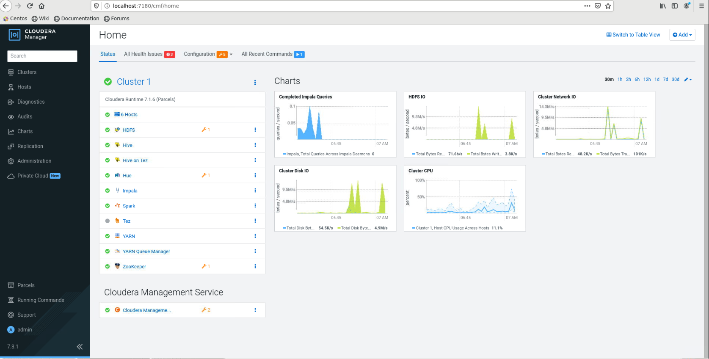
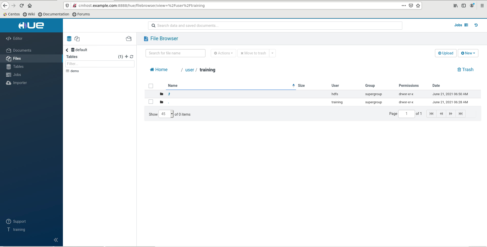

3. Test cluster

[[toc]]
# 3. Test cluster

## CM



## Hue



## Create home hdfs user training


```
training@cmhost.example.com:~$ sudo -u hdfs hdfs dfs -mkdir /user/training
training@cmhost.example.com:~$ sudo -u hdfs hdfs dfs -chown training /user/training
````

## Test YARN
```
yarn jar /opt/cloudera/parcels/CDH/lib/hadoop-mapreduce/hadoop-mapreduce-examples.jar pi 10 100
Number of Maps  = 10
Samples per Map = 100
Wrote input for Map #0
Wrote input for Map #1
Wrote input for Map #2
Wrote input for Map #3
Wrote input for Map #4
Wrote input for Map #5
Wrote input for Map #6
Wrote input for Map #7
Wrote input for Map #8
Wrote input for Map #9
Starting Job
21/06/21 06:28:47 WARN impl.MetricsConfig: Cannot locate configuration: tried hadoop-metrics2-jobtracker.properties,hadoop-metrics2.properties
21/06/21 06:28:47 INFO impl.MetricsSystemImpl: Scheduled Metric snapshot period at 10 second(s).
21/06/21 06:28:47 INFO impl.MetricsSystemImpl: JobTracker metrics system started
21/06/21 06:28:47 INFO input.FileInputFormat: Total input files to process : 10
21/06/21 06:28:47 INFO mapreduce.JobSubmitter: number of splits:10
21/06/21 06:28:47 INFO mapreduce.JobSubmitter: Submitting tokens for job: job_local30731063_0001
21/06/21 06:28:47 INFO mapreduce.JobSubmitter: Executing with tokens: []
21/06/21 06:28:47 INFO mapreduce.Job: The url to track the job: http://localhost:8080/
21/06/21 06:28:47 INFO mapreduce.Job: Running job: job_local30731063_0001
21/06/21 06:28:47 INFO mapred.LocalJobRunner: OutputCommitter set in config null
21/06/21 06:28:47 INFO output.FileOutputCommitter: File Output Committer Algorithm version is 2
21/06/21 06:28:47 INFO output.FileOutputCommitter: FileOutputCommitter skip cleanup _temporary folders under output directory:false, ignore cleanup failures: false
21/06/21 06:28:47 INFO mapred.LocalJobRunner: OutputCommitter is org.apache.hadoop.mapreduce.lib.output.FileOutputCommitter
21/06/21 06:28:48 INFO mapred.LocalJobRunner: Waiting for map tasks
21/06/21 06:28:48 INFO mapred.LocalJobRunner: Starting task: attempt_local30731063_0001_m_000000_0
21/06/21 06:28:48 INFO output.FileOutputCommitter: File Output Committer Algorithm version is 2
21/06/21 06:28:48 INFO output.FileOutputCommitter: FileOutputCommitter skip cleanup _temporary folders under output directory:false, ignore cleanup failures: false
21/06/21 06:28:48 INFO mapred.Task:  Using ResourceCalculatorProcessTree : [ ]
21/06/21 06:28:48 INFO mapred.MapTask: Processing split: hdfs://master-1.example.com:8020/user/training/QuasiMonteCarlo_1624282125861_1718541702/in/part0:0+118
21/06/21 06:28:48 INFO mapred.MapTask: (EQUATOR) 0 kvi 26214396(104857584)
21/06/21 06:28:48 INFO mapred.MapTask: mapreduce.task.io.sort.mb: 100
21/06/21 06:28:48 INFO mapred.MapTask: soft limit at 83886080
21/06/21 06:28:48 INFO mapred.MapTask: bufstart = 0; bufvoid = 104857600
21/06/21 06:28:48 INFO mapred.MapTask: kvstart = 26214396; length = 6553600
21/06/21 06:28:48 INFO mapred.MapTask: Map output collector class = org.apache.hadoop.mapred.MapTask$MapOutputBuffer
21/06/21 06:28:48 INFO mapred.LocalJobRunner:
21/06/21 06:28:48 INFO mapred.MapTask: Starting flush of map output
21/06/21 06:28:48 INFO mapred.MapTask: Spilling map output
21/06/21 06:28:48 INFO mapred.MapTask: bufstart = 0; bufend = 18; bufvoid = 104857600
21/06/21 06:28:48 INFO mapred.MapTask: kvstart = 26214396(104857584); kvend = 26214392(104857568); length = 5/6553600
21/06/21 06:28:48 INFO mapred.MapTask: Finished spill 0
21/06/21 06:28:48 INFO mapred.Task: Task:attempt_local30731063_0001_m_000000_0 is done. And is in the process of committing
21/06/21 06:28:48 INFO mapred.LocalJobRunner: map
21/06/21 06:28:48 INFO mapred.Task: Task 'attempt_local30731063_0001_m_000000_0' done.
21/06/21 06:28:48 INFO mapred.Task: Final Counters for attempt_local30731063_0001_m_000000_0: Counters: 23
	File System Counters
		FILE: Number of bytes read=337196
		FILE: Number of bytes written=887331
		FILE: Number of read operations=0
		FILE: Number of large read operations=0
		FILE: Number of write operations=0
		HDFS: Number of bytes read=118
		HDFS: Number of bytes written=1180
		HDFS: Number of read operations=7
		HDFS: Number of large read operations=0
		HDFS: Number of write operations=12
		HDFS: Number of bytes read erasure-coded=0
	Map-Reduce Framework
		Map input records=1
		Map output records=2
		Map output bytes=18
		Map output materialized bytes=28
		Input split bytes=161
		Combine input records=0
		Spilled Records=2
		Failed Shuffles=0
		Merged Map outputs=0
		GC time elapsed (ms)=0
		Total committed heap usage (bytes)=252182528
	File Input Format Counters
		Bytes Read=118
21/06/21 06:28:48 INFO mapred.LocalJobRunner: Finishing task: attempt_local30731063_0001_m_000000_0
21/06/21 06:28:48 INFO mapred.LocalJobRunner: Starting task: attempt_local30731063_0001_m_000001_0
21/06/21 06:28:48 INFO output.FileOutputCommitter: File Output Committer Algorithm version is 2
21/06/21 06:28:48 INFO output.FileOutputCommitter: FileOutputCommitter skip cleanup _temporary folders under output directory:false, ignore cleanup failures: false
21/06/21 06:28:48 INFO mapred.Task:  Using ResourceCalculatorProcessTree : [ ]
21/06/21 06:28:48 INFO mapred.MapTask: Processing split: hdfs://master-1.example.com:8020/user/training/QuasiMonteCarlo_1624282125861_1718541702/in/part1:0+118
21/06/21 06:28:48 INFO mapred.MapTask: (EQUATOR) 0 kvi 26214396(104857584)
21/06/21 06:28:48 INFO mapred.MapTask: mapreduce.task.io.sort.mb: 100
21/06/21 06:28:48 INFO mapred.MapTask: soft limit at 83886080
21/06/21 06:28:48 INFO mapred.MapTask: bufstart = 0; bufvoid = 104857600
21/06/21 06:28:48 INFO mapred.MapTask: kvstart = 26214396; length = 6553600
21/06/21 06:28:48 INFO mapred.MapTask: Map output collector class = org.apache.hadoop.mapred.MapTask$MapOutputBuffer
21/06/21 06:28:48 INFO mapred.LocalJobRunner:
21/06/21 06:28:48 INFO mapred.MapTask: Starting flush of map output
21/06/21 06:28:48 INFO mapred.MapTask: Spilling map output
21/06/21 06:28:48 INFO mapred.MapTask: bufstart = 0; bufend = 18; bufvoid = 104857600
21/06/21 06:28:48 INFO mapred.MapTask: kvstart = 26214396(104857584); kvend = 26214392(104857568); length = 5/6553600
21/06/21 06:28:48 INFO mapred.MapTask: Finished spill 0
21/06/21 06:28:48 INFO mapred.Task: Task:attempt_local30731063_0001_m_000001_0 is done. And is in the process of committing
21/06/21 06:28:48 INFO mapred.LocalJobRunner: map
21/06/21 06:28:48 INFO mapred.Task: Task 'attempt_local30731063_0001_m_000001_0' done.
21/06/21 06:28:48 INFO mapred.Task: Final Counters for attempt_local30731063_0001_m_000001_0: Counters: 23
	File System Counters
		FILE: Number of bytes read=338837
		FILE: Number of bytes written=887391
		FILE: Number of read operations=0
		FILE: Number of large read operations=0
		FILE: Number of write operations=0
		HDFS: Number of bytes read=236
		HDFS: Number of bytes written=1180
		HDFS: Number of read operations=10
		HDFS: Number of large read operations=0
		HDFS: Number of write operations=12
		HDFS: Number of bytes read erasure-coded=0
	Map-Reduce Framework
		Map input records=1
		Map output records=2
		Map output bytes=18
		Map output materialized bytes=28
		Input split bytes=161
		Combine input records=0
		Spilled Records=2
		Failed Shuffles=0
		Merged Map outputs=0
		GC time elapsed (ms)=48
		Total committed heap usage (bytes)=256376832
	File Input Format Counters
		Bytes Read=118
21/06/21 06:28:48 INFO mapred.LocalJobRunner: Finishing task: attempt_local30731063_0001_m_000001_0
21/06/21 06:28:48 INFO mapred.LocalJobRunner: Starting task: attempt_local30731063_0001_m_000002_0
21/06/21 06:28:48 INFO output.FileOutputCommitter: File Output Committer Algorithm version is 2
21/06/21 06:28:48 INFO output.FileOutputCommitter: FileOutputCommitter skip cleanup _temporary folders under output directory:false, ignore cleanup failures: false
21/06/21 06:28:48 INFO mapred.Task:  Using ResourceCalculatorProcessTree : [ ]
21/06/21 06:28:48 INFO mapred.MapTask: Processing split: hdfs://master-1.example.com:8020/user/training/QuasiMonteCarlo_1624282125861_1718541702/in/part2:0+118
21/06/21 06:28:48 INFO mapred.MapTask: (EQUATOR) 0 kvi 26214396(104857584)
21/06/21 06:28:48 INFO mapred.MapTask: mapreduce.task.io.sort.mb: 100
21/06/21 06:28:48 INFO mapred.MapTask: soft limit at 83886080
21/06/21 06:28:48 INFO mapred.MapTask: bufstart = 0; bufvoid = 104857600
21/06/21 06:28:48 INFO mapred.MapTask: kvstart = 26214396; length = 6553600
21/06/21 06:28:48 INFO mapred.MapTask: Map output collector class = org.apache.hadoop.mapred.MapTask$MapOutputBuffer
21/06/21 06:28:48 INFO mapred.LocalJobRunner:
21/06/21 06:28:48 INFO mapred.MapTask: Starting flush of map output
21/06/21 06:28:48 INFO mapred.MapTask: Spilling map output
21/06/21 06:28:48 INFO mapred.MapTask: bufstart = 0; bufend = 18; bufvoid = 104857600
21/06/21 06:28:48 INFO mapred.MapTask: kvstart = 26214396(104857584); kvend = 26214392(104857568); length = 5/6553600
21/06/21 06:28:48 INFO mapred.MapTask: Finished spill 0
21/06/21 06:28:48 INFO mapred.Task: Task:attempt_local30731063_0001_m_000002_0 is done. And is in the process of committing
21/06/21 06:28:48 INFO mapred.LocalJobRunner: map
21/06/21 06:28:48 INFO mapred.Task: Task 'attempt_local30731063_0001_m_000002_0' done.
21/06/21 06:28:48 INFO mapred.Task: Final Counters for attempt_local30731063_0001_m_000002_0: Counters: 23
	File System Counters
		FILE: Number of bytes read=340478
		FILE: Number of bytes written=887451
		FILE: Number of read operations=0
		FILE: Number of large read operations=0
		FILE: Number of write operations=0
		HDFS: Number of bytes read=354
		HDFS: Number of bytes written=1180
		HDFS: Number of read operations=13
		HDFS: Number of large read operations=0
		HDFS: Number of write operations=12
		HDFS: Number of bytes read erasure-coded=0
	Map-Reduce Framework
		Map input records=1
		Map output records=2
		Map output bytes=18
		Map output materialized bytes=28
		Input split bytes=161
		Combine input records=0
		Spilled Records=2
		Failed Shuffles=0
		Merged Map outputs=0
		GC time elapsed (ms)=75
		Total committed heap usage (bytes)=199753728
	File Input Format Counters
		Bytes Read=118
21/06/21 06:28:48 INFO mapred.LocalJobRunner: Finishing task: attempt_local30731063_0001_m_000002_0
21/06/21 06:28:48 INFO mapred.LocalJobRunner: Starting task: attempt_local30731063_0001_m_000003_0
21/06/21 06:28:48 INFO output.FileOutputCommitter: File Output Committer Algorithm version is 2
21/06/21 06:28:48 INFO output.FileOutputCommitter: FileOutputCommitter skip cleanup _temporary folders under output directory:false, ignore cleanup failures: false
21/06/21 06:28:48 INFO mapred.Task:  Using ResourceCalculatorProcessTree : [ ]
21/06/21 06:28:48 INFO mapred.MapTask: Processing split: hdfs://master-1.example.com:8020/user/training/QuasiMonteCarlo_1624282125861_1718541702/in/part3:0+118
21/06/21 06:28:48 INFO mapred.MapTask: (EQUATOR) 0 kvi 26214396(104857584)
21/06/21 06:28:48 INFO mapred.MapTask: mapreduce.task.io.sort.mb: 100
21/06/21 06:28:48 INFO mapred.MapTask: soft limit at 83886080
21/06/21 06:28:48 INFO mapred.MapTask: bufstart = 0; bufvoid = 104857600
21/06/21 06:28:48 INFO mapred.MapTask: kvstart = 26214396; length = 6553600
21/06/21 06:28:48 INFO mapred.MapTask: Map output collector class = org.apache.hadoop.mapred.MapTask$MapOutputBuffer
21/06/21 06:28:48 INFO mapred.LocalJobRunner:
21/06/21 06:28:48 INFO mapred.MapTask: Starting flush of map output
21/06/21 06:28:48 INFO mapred.MapTask: Spilling map output
21/06/21 06:28:48 INFO mapred.MapTask: bufstart = 0; bufend = 18; bufvoid = 104857600
21/06/21 06:28:48 INFO mapred.MapTask: kvstart = 26214396(104857584); kvend = 26214392(104857568); length = 5/6553600
21/06/21 06:28:48 INFO mapred.MapTask: Finished spill 0
21/06/21 06:28:48 INFO mapred.Task: Task:attempt_local30731063_0001_m_000003_0 is done. And is in the process of committing
21/06/21 06:28:48 INFO mapred.LocalJobRunner: map
21/06/21 06:28:48 INFO mapred.Task: Task 'attempt_local30731063_0001_m_000003_0' done.
21/06/21 06:28:48 INFO mapred.Task: Final Counters for attempt_local30731063_0001_m_000003_0: Counters: 23
	File System Counters
		FILE: Number of bytes read=342119
		FILE: Number of bytes written=887511
		FILE: Number of read operations=0
		FILE: Number of large read operations=0
		FILE: Number of write operations=0
		HDFS: Number of bytes read=472
		HDFS: Number of bytes written=1180
		HDFS: Number of read operations=16
		HDFS: Number of large read operations=0
		HDFS: Number of write operations=12
		HDFS: Number of bytes read erasure-coded=0
	Map-Reduce Framework
		Map input records=1
		Map output records=2
		Map output bytes=18
		Map output materialized bytes=28
		Input split bytes=161
		Combine input records=0
		Spilled Records=2
		Failed Shuffles=0
		Merged Map outputs=0
		GC time elapsed (ms)=35
		Total committed heap usage (bytes)=233308160
	File Input Format Counters
		Bytes Read=118
21/06/21 06:28:48 INFO mapred.LocalJobRunner: Finishing task: attempt_local30731063_0001_m_000003_0
21/06/21 06:28:48 INFO mapred.LocalJobRunner: Starting task: attempt_local30731063_0001_m_000004_0
21/06/21 06:28:48 INFO output.FileOutputCommitter: File Output Committer Algorithm version is 2
21/06/21 06:28:48 INFO output.FileOutputCommitter: FileOutputCommitter skip cleanup _temporary folders under output directory:false, ignore cleanup failures: false
21/06/21 06:28:48 INFO mapred.Task:  Using ResourceCalculatorProcessTree : [ ]
21/06/21 06:28:48 INFO mapred.MapTask: Processing split: hdfs://master-1.example.com:8020/user/training/QuasiMonteCarlo_1624282125861_1718541702/in/part4:0+118
21/06/21 06:28:48 INFO mapred.MapTask: (EQUATOR) 0 kvi 26214396(104857584)
21/06/21 06:28:48 INFO mapred.MapTask: mapreduce.task.io.sort.mb: 100
21/06/21 06:28:48 INFO mapred.MapTask: soft limit at 83886080
21/06/21 06:28:48 INFO mapred.MapTask: bufstart = 0; bufvoid = 104857600
21/06/21 06:28:48 INFO mapred.MapTask: kvstart = 26214396; length = 6553600
21/06/21 06:28:48 INFO mapred.MapTask: Map output collector class = org.apache.hadoop.mapred.MapTask$MapOutputBuffer
21/06/21 06:28:48 INFO mapred.LocalJobRunner:
21/06/21 06:28:48 INFO mapred.MapTask: Starting flush of map output
21/06/21 06:28:48 INFO mapred.MapTask: Spilling map output
21/06/21 06:28:48 INFO mapred.MapTask: bufstart = 0; bufend = 18; bufvoid = 104857600
21/06/21 06:28:48 INFO mapred.MapTask: kvstart = 26214396(104857584); kvend = 26214392(104857568); length = 5/6553600
21/06/21 06:28:48 INFO mapred.MapTask: Finished spill 0
21/06/21 06:28:48 INFO mapred.Task: Task:attempt_local30731063_0001_m_000004_0 is done. And is in the process of committing
21/06/21 06:28:48 INFO mapred.LocalJobRunner: map
21/06/21 06:28:48 INFO mapred.Task: Task 'attempt_local30731063_0001_m_000004_0' done.
21/06/21 06:28:48 INFO mapred.Task: Final Counters for attempt_local30731063_0001_m_000004_0: Counters: 23
	File System Counters
		FILE: Number of bytes read=343248
		FILE: Number of bytes written=887571
		FILE: Number of read operations=0
		FILE: Number of large read operations=0
		FILE: Number of write operations=0
		HDFS: Number of bytes read=590
		HDFS: Number of bytes written=1180
		HDFS: Number of read operations=19
		HDFS: Number of large read operations=0
		HDFS: Number of write operations=12
		HDFS: Number of bytes read erasure-coded=0
	Map-Reduce Framework
		Map input records=1
		Map output records=2
		Map output bytes=18
		Map output materialized bytes=28
		Input split bytes=161
		Combine input records=0
		Spilled Records=2
		Failed Shuffles=0
		Merged Map outputs=0
		GC time elapsed (ms)=24
		Total committed heap usage (bytes)=252706816
	File Input Format Counters
		Bytes Read=118
21/06/21 06:28:48 INFO mapred.LocalJobRunner: Finishing task: attempt_local30731063_0001_m_000004_0
21/06/21 06:28:48 INFO mapred.LocalJobRunner: Starting task: attempt_local30731063_0001_m_000005_0
21/06/21 06:28:48 INFO output.FileOutputCommitter: File Output Committer Algorithm version is 2
21/06/21 06:28:48 INFO output.FileOutputCommitter: FileOutputCommitter skip cleanup _temporary folders under output directory:false, ignore cleanup failures: false
21/06/21 06:28:48 INFO mapred.Task:  Using ResourceCalculatorProcessTree : [ ]
21/06/21 06:28:48 INFO mapred.MapTask: Processing split: hdfs://master-1.example.com:8020/user/training/QuasiMonteCarlo_1624282125861_1718541702/in/part5:0+118
21/06/21 06:28:48 INFO mapred.MapTask: (EQUATOR) 0 kvi 26214396(104857584)
21/06/21 06:28:48 INFO mapred.MapTask: mapreduce.task.io.sort.mb: 100
21/06/21 06:28:48 INFO mapred.MapTask: soft limit at 83886080
21/06/21 06:28:48 INFO mapred.MapTask: bufstart = 0; bufvoid = 104857600
21/06/21 06:28:48 INFO mapred.MapTask: kvstart = 26214396; length = 6553600
21/06/21 06:28:48 INFO mapred.MapTask: Map output collector class = org.apache.hadoop.mapred.MapTask$MapOutputBuffer
21/06/21 06:28:48 INFO mapred.LocalJobRunner:
21/06/21 06:28:48 INFO mapred.MapTask: Starting flush of map output
21/06/21 06:28:48 INFO mapred.MapTask: Spilling map output
21/06/21 06:28:48 INFO mapred.MapTask: bufstart = 0; bufend = 18; bufvoid = 104857600
21/06/21 06:28:48 INFO mapred.MapTask: kvstart = 26214396(104857584); kvend = 26214392(104857568); length = 5/6553600
21/06/21 06:28:48 INFO mapred.MapTask: Finished spill 0
21/06/21 06:28:48 INFO mapred.Task: Task:attempt_local30731063_0001_m_000005_0 is done. And is in the process of committing
21/06/21 06:28:48 INFO mapred.LocalJobRunner: map
21/06/21 06:28:48 INFO mapred.Task: Task 'attempt_local30731063_0001_m_000005_0' done.
21/06/21 06:28:48 INFO mapred.Task: Final Counters for attempt_local30731063_0001_m_000005_0: Counters: 23
	File System Counters
		FILE: Number of bytes read=344377
		FILE: Number of bytes written=887631
		FILE: Number of read operations=0
		FILE: Number of large read operations=0
		FILE: Number of write operations=0
		HDFS: Number of bytes read=708
		HDFS: Number of bytes written=1180
		HDFS: Number of read operations=22
		HDFS: Number of large read operations=0
		HDFS: Number of write operations=12
		HDFS: Number of bytes read erasure-coded=0
	Map-Reduce Framework
		Map input records=1
		Map output records=2
		Map output bytes=18
		Map output materialized bytes=28
		Input split bytes=161
		Combine input records=0
		Spilled Records=2
		Failed Shuffles=0
		Merged Map outputs=0
		GC time elapsed (ms)=21
		Total committed heap usage (bytes)=256376832
	File Input Format Counters
		Bytes Read=118
21/06/21 06:28:48 INFO mapred.LocalJobRunner: Finishing task: attempt_local30731063_0001_m_000005_0
21/06/21 06:28:48 INFO mapred.LocalJobRunner: Starting task: attempt_local30731063_0001_m_000006_0
21/06/21 06:28:48 INFO output.FileOutputCommitter: File Output Committer Algorithm version is 2
21/06/21 06:28:48 INFO output.FileOutputCommitter: FileOutputCommitter skip cleanup _temporary folders under output directory:false, ignore cleanup failures: false
21/06/21 06:28:48 INFO mapred.Task:  Using ResourceCalculatorProcessTree : [ ]
21/06/21 06:28:48 INFO mapred.MapTask: Processing split: hdfs://master-1.example.com:8020/user/training/QuasiMonteCarlo_1624282125861_1718541702/in/part6:0+118
21/06/21 06:28:48 INFO mapred.MapTask: (EQUATOR) 0 kvi 26214396(104857584)
21/06/21 06:28:48 INFO mapred.MapTask: mapreduce.task.io.sort.mb: 100
21/06/21 06:28:48 INFO mapred.MapTask: soft limit at 83886080
21/06/21 06:28:48 INFO mapred.MapTask: bufstart = 0; bufvoid = 104857600
21/06/21 06:28:48 INFO mapred.MapTask: kvstart = 26214396; length = 6553600
21/06/21 06:28:48 INFO mapred.MapTask: Map output collector class = org.apache.hadoop.mapred.MapTask$MapOutputBuffer
21/06/21 06:28:48 INFO mapred.LocalJobRunner:
21/06/21 06:28:48 INFO mapred.MapTask: Starting flush of map output
21/06/21 06:28:48 INFO mapred.MapTask: Spilling map output
21/06/21 06:28:48 INFO mapred.MapTask: bufstart = 0; bufend = 18; bufvoid = 104857600
21/06/21 06:28:48 INFO mapred.MapTask: kvstart = 26214396(104857584); kvend = 26214392(104857568); length = 5/6553600
21/06/21 06:28:48 INFO mapred.MapTask: Finished spill 0
21/06/21 06:28:48 INFO mapred.Task: Task:attempt_local30731063_0001_m_000006_0 is done. And is in the process of committing
21/06/21 06:28:48 INFO mapred.LocalJobRunner: map
21/06/21 06:28:48 INFO mapred.Task: Task 'attempt_local30731063_0001_m_000006_0' done.
21/06/21 06:28:48 INFO mapred.Task: Final Counters for attempt_local30731063_0001_m_000006_0: Counters: 23
	File System Counters
		FILE: Number of bytes read=345506
		FILE: Number of bytes written=887691
		FILE: Number of read operations=0
		FILE: Number of large read operations=0
		FILE: Number of write operations=0
		HDFS: Number of bytes read=826
		HDFS: Number of bytes written=1180
		HDFS: Number of read operations=25
		HDFS: Number of large read operations=0
		HDFS: Number of write operations=12
		HDFS: Number of bytes read erasure-coded=0
	Map-Reduce Framework
		Map input records=1
		Map output records=2
		Map output bytes=18
		Map output materialized bytes=28
		Input split bytes=161
		Combine input records=0
		Spilled Records=2
		Failed Shuffles=0
		Merged Map outputs=0
		GC time elapsed (ms)=25
		Total committed heap usage (bytes)=256901120
	File Input Format Counters
		Bytes Read=118
21/06/21 06:28:48 INFO mapred.LocalJobRunner: Finishing task: attempt_local30731063_0001_m_000006_0
21/06/21 06:28:48 INFO mapred.LocalJobRunner: Starting task: attempt_local30731063_0001_m_000007_0
21/06/21 06:28:48 INFO output.FileOutputCommitter: File Output Committer Algorithm version is 2
21/06/21 06:28:48 INFO output.FileOutputCommitter: FileOutputCommitter skip cleanup _temporary folders under output directory:false, ignore cleanup failures: false
21/06/21 06:28:48 INFO mapred.Task:  Using ResourceCalculatorProcessTree : [ ]
21/06/21 06:28:48 INFO mapred.MapTask: Processing split: hdfs://master-1.example.com:8020/user/training/QuasiMonteCarlo_1624282125861_1718541702/in/part7:0+118
21/06/21 06:28:48 INFO mapred.MapTask: (EQUATOR) 0 kvi 26214396(104857584)
21/06/21 06:28:48 INFO mapred.MapTask: mapreduce.task.io.sort.mb: 100
21/06/21 06:28:48 INFO mapred.MapTask: soft limit at 83886080
21/06/21 06:28:48 INFO mapred.MapTask: bufstart = 0; bufvoid = 104857600
21/06/21 06:28:48 INFO mapred.MapTask: kvstart = 26214396; length = 6553600
21/06/21 06:28:48 INFO mapred.MapTask: Map output collector class = org.apache.hadoop.mapred.MapTask$MapOutputBuffer
21/06/21 06:28:48 INFO mapred.LocalJobRunner:
21/06/21 06:28:48 INFO mapred.MapTask: Starting flush of map output
21/06/21 06:28:48 INFO mapred.MapTask: Spilling map output
21/06/21 06:28:48 INFO mapred.MapTask: bufstart = 0; bufend = 18; bufvoid = 104857600
21/06/21 06:28:48 INFO mapred.MapTask: kvstart = 26214396(104857584); kvend = 26214392(104857568); length = 5/6553600
21/06/21 06:28:48 INFO mapred.MapTask: Finished spill 0
21/06/21 06:28:48 INFO mapred.Task: Task:attempt_local30731063_0001_m_000007_0 is done. And is in the process of committing
21/06/21 06:28:48 INFO mapred.LocalJobRunner: map
21/06/21 06:28:48 INFO mapred.Task: Task 'attempt_local30731063_0001_m_000007_0' done.
21/06/21 06:28:48 INFO mapred.Task: Final Counters for attempt_local30731063_0001_m_000007_0: Counters: 23
	File System Counters
		FILE: Number of bytes read=346123
		FILE: Number of bytes written=887751
		FILE: Number of read operations=0
		FILE: Number of large read operations=0
		FILE: Number of write operations=0
		HDFS: Number of bytes read=944
		HDFS: Number of bytes written=1180
		HDFS: Number of read operations=28
		HDFS: Number of large read operations=0
		HDFS: Number of write operations=12
		HDFS: Number of bytes read erasure-coded=0
	Map-Reduce Framework
		Map input records=1
		Map output records=2
		Map output bytes=18
		Map output materialized bytes=28
		Input split bytes=161
		Combine input records=0
		Spilled Records=2
		Failed Shuffles=0
		Merged Map outputs=0
		GC time elapsed (ms)=23
		Total committed heap usage (bytes)=257425408
	File Input Format Counters
		Bytes Read=118
21/06/21 06:28:48 INFO mapred.LocalJobRunner: Finishing task: attempt_local30731063_0001_m_000007_0
21/06/21 06:28:48 INFO mapred.LocalJobRunner: Starting task: attempt_local30731063_0001_m_000008_0
21/06/21 06:28:48 INFO output.FileOutputCommitter: File Output Committer Algorithm version is 2
21/06/21 06:28:48 INFO output.FileOutputCommitter: FileOutputCommitter skip cleanup _temporary folders under output directory:false, ignore cleanup failures: false
21/06/21 06:28:48 INFO mapred.Task:  Using ResourceCalculatorProcessTree : [ ]
21/06/21 06:28:48 INFO mapred.MapTask: Processing split: hdfs://master-1.example.com:8020/user/training/QuasiMonteCarlo_1624282125861_1718541702/in/part8:0+118
21/06/21 06:28:48 INFO mapred.MapTask: (EQUATOR) 0 kvi 26214396(104857584)
21/06/21 06:28:48 INFO mapred.MapTask: mapreduce.task.io.sort.mb: 100
21/06/21 06:28:48 INFO mapred.MapTask: soft limit at 83886080
21/06/21 06:28:48 INFO mapred.MapTask: bufstart = 0; bufvoid = 104857600
21/06/21 06:28:48 INFO mapred.MapTask: kvstart = 26214396; length = 6553600
21/06/21 06:28:48 INFO mapred.MapTask: Map output collector class = org.apache.hadoop.mapred.MapTask$MapOutputBuffer
21/06/21 06:28:48 INFO mapred.LocalJobRunner:
21/06/21 06:28:48 INFO mapred.MapTask: Starting flush of map output
21/06/21 06:28:48 INFO mapred.MapTask: Spilling map output
21/06/21 06:28:48 INFO mapred.MapTask: bufstart = 0; bufend = 18; bufvoid = 104857600
21/06/21 06:28:48 INFO mapred.MapTask: kvstart = 26214396(104857584); kvend = 26214392(104857568); length = 5/6553600
21/06/21 06:28:48 INFO mapred.MapTask: Finished spill 0
21/06/21 06:28:48 INFO mapred.Task: Task:attempt_local30731063_0001_m_000008_0 is done. And is in the process of committing
21/06/21 06:28:48 INFO mapred.LocalJobRunner: map
21/06/21 06:28:48 INFO mapred.Task: Task 'attempt_local30731063_0001_m_000008_0' done.
21/06/21 06:28:48 INFO mapred.Task: Final Counters for attempt_local30731063_0001_m_000008_0: Counters: 23
	File System Counters
		FILE: Number of bytes read=346740
		FILE: Number of bytes written=887811
		FILE: Number of read operations=0
		FILE: Number of large read operations=0
		FILE: Number of write operations=0
		HDFS: Number of bytes read=1062
		HDFS: Number of bytes written=1180
		HDFS: Number of read operations=31
		HDFS: Number of large read operations=0
		HDFS: Number of write operations=12
		HDFS: Number of bytes read erasure-coded=0
	Map-Reduce Framework
		Map input records=1
		Map output records=2
		Map output bytes=18
		Map output materialized bytes=28
		Input split bytes=161
		Combine input records=0
		Spilled Records=2
		Failed Shuffles=0
		Merged Map outputs=0
		GC time elapsed (ms)=24
		Total committed heap usage (bytes)=257949696
	File Input Format Counters
		Bytes Read=118
21/06/21 06:28:48 INFO mapred.LocalJobRunner: Finishing task: attempt_local30731063_0001_m_000008_0
21/06/21 06:28:48 INFO mapred.LocalJobRunner: Starting task: attempt_local30731063_0001_m_000009_0
21/06/21 06:28:48 INFO output.FileOutputCommitter: File Output Committer Algorithm version is 2
21/06/21 06:28:48 INFO output.FileOutputCommitter: FileOutputCommitter skip cleanup _temporary folders under output directory:false, ignore cleanup failures: false
21/06/21 06:28:48 INFO mapred.Task:  Using ResourceCalculatorProcessTree : [ ]
21/06/21 06:28:48 INFO mapred.MapTask: Processing split: hdfs://master-1.example.com:8020/user/training/QuasiMonteCarlo_1624282125861_1718541702/in/part9:0+118
21/06/21 06:28:48 INFO mapred.MapTask: (EQUATOR) 0 kvi 26214396(104857584)
21/06/21 06:28:48 INFO mapred.MapTask: mapreduce.task.io.sort.mb: 100
21/06/21 06:28:48 INFO mapred.MapTask: soft limit at 83886080
21/06/21 06:28:48 INFO mapred.MapTask: bufstart = 0; bufvoid = 104857600
21/06/21 06:28:48 INFO mapred.MapTask: kvstart = 26214396; length = 6553600
21/06/21 06:28:48 INFO mapred.MapTask: Map output collector class = org.apache.hadoop.mapred.MapTask$MapOutputBuffer
21/06/21 06:28:48 INFO mapred.LocalJobRunner:
21/06/21 06:28:48 INFO mapred.MapTask: Starting flush of map output
21/06/21 06:28:48 INFO mapred.MapTask: Spilling map output
21/06/21 06:28:48 INFO mapred.MapTask: bufstart = 0; bufend = 18; bufvoid = 104857600
21/06/21 06:28:48 INFO mapred.MapTask: kvstart = 26214396(104857584); kvend = 26214392(104857568); length = 5/6553600
21/06/21 06:28:48 INFO mapred.MapTask: Finished spill 0
21/06/21 06:28:48 INFO mapred.Task: Task:attempt_local30731063_0001_m_000009_0 is done. And is in the process of committing
21/06/21 06:28:48 INFO mapred.LocalJobRunner: map
21/06/21 06:28:48 INFO mapred.Task: Task 'attempt_local30731063_0001_m_000009_0' done.
21/06/21 06:28:48 INFO mapred.Task: Final Counters for attempt_local30731063_0001_m_000009_0: Counters: 23
	File System Counters
		FILE: Number of bytes read=347357
		FILE: Number of bytes written=887871
		FILE: Number of read operations=0
		FILE: Number of large read operations=0
		FILE: Number of write operations=0
		HDFS: Number of bytes read=1180
		HDFS: Number of bytes written=1180
		HDFS: Number of read operations=34
		HDFS: Number of large read operations=0
		HDFS: Number of write operations=12
		HDFS: Number of bytes read erasure-coded=0
	Map-Reduce Framework
		Map input records=1
		Map output records=2
		Map output bytes=18
		Map output materialized bytes=28
		Input split bytes=161
		Combine input records=0
		Spilled Records=2
		Failed Shuffles=0
		Merged Map outputs=0
		GC time elapsed (ms)=24
		Total committed heap usage (bytes)=258998272
	File Input Format Counters
		Bytes Read=118
21/06/21 06:28:48 INFO mapred.LocalJobRunner: Finishing task: attempt_local30731063_0001_m_000009_0
21/06/21 06:28:48 INFO mapred.LocalJobRunner: map task executor complete.
21/06/21 06:28:48 INFO mapred.LocalJobRunner: Waiting for reduce tasks
21/06/21 06:28:48 INFO mapred.LocalJobRunner: Starting task: attempt_local30731063_0001_r_000000_0
21/06/21 06:28:48 INFO output.FileOutputCommitter: File Output Committer Algorithm version is 2
21/06/21 06:28:48 INFO output.FileOutputCommitter: FileOutputCommitter skip cleanup _temporary folders under output directory:false, ignore cleanup failures: false
21/06/21 06:28:48 INFO mapred.Task:  Using ResourceCalculatorProcessTree : [ ]
21/06/21 06:28:48 INFO mapred.ReduceTask: Using ShuffleConsumerPlugin: org.apache.hadoop.mapreduce.task.reduce.Shuffle@77d7c117
21/06/21 06:28:48 WARN impl.MetricsSystemImpl: JobTracker metrics system already initialized!
21/06/21 06:28:48 INFO reduce.MergeManagerImpl: MergerManager: memoryLimit=181298784, maxSingleShuffleLimit=45324696, mergeThreshold=119657200, ioSortFactor=10, memToMemMergeOutputsThreshold=10
21/06/21 06:28:48 INFO reduce.EventFetcher: attempt_local30731063_0001_r_000000_0 Thread started: EventFetcher for fetching Map Completion Events
21/06/21 06:28:48 INFO reduce.LocalFetcher: localfetcher#1 about to shuffle output of map attempt_local30731063_0001_m_000000_0 decomp: 24 len: 28 to MEMORY
21/06/21 06:28:48 INFO reduce.InMemoryMapOutput: Read 24 bytes from map-output for attempt_local30731063_0001_m_000000_0
21/06/21 06:28:48 INFO reduce.MergeManagerImpl: closeInMemoryFile -> map-output of size: 24, inMemoryMapOutputs.size() -> 1, commitMemory -> 0, usedMemory ->24
21/06/21 06:28:48 INFO reduce.LocalFetcher: localfetcher#1 about to shuffle output of map attempt_local30731063_0001_m_000007_0 decomp: 24 len: 28 to MEMORY
21/06/21 06:28:48 INFO reduce.InMemoryMapOutput: Read 24 bytes from map-output for attempt_local30731063_0001_m_000007_0
21/06/21 06:28:48 INFO reduce.MergeManagerImpl: closeInMemoryFile -> map-output of size: 24, inMemoryMapOutputs.size() -> 2, commitMemory -> 24, usedMemory ->48
21/06/21 06:28:48 INFO reduce.LocalFetcher: localfetcher#1 about to shuffle output of map attempt_local30731063_0001_m_000004_0 decomp: 24 len: 28 to MEMORY
21/06/21 06:28:48 INFO reduce.InMemoryMapOutput: Read 24 bytes from map-output for attempt_local30731063_0001_m_000004_0
21/06/21 06:28:48 INFO reduce.MergeManagerImpl: closeInMemoryFile -> map-output of size: 24, inMemoryMapOutputs.size() -> 3, commitMemory -> 48, usedMemory ->72
21/06/21 06:28:48 INFO reduce.LocalFetcher: localfetcher#1 about to shuffle output of map attempt_local30731063_0001_m_000001_0 decomp: 24 len: 28 to MEMORY
21/06/21 06:28:48 INFO reduce.InMemoryMapOutput: Read 24 bytes from map-output for attempt_local30731063_0001_m_000001_0
21/06/21 06:28:48 INFO reduce.MergeManagerImpl: closeInMemoryFile -> map-output of size: 24, inMemoryMapOutputs.size() -> 4, commitMemory -> 72, usedMemory ->96
21/06/21 06:28:48 INFO reduce.LocalFetcher: localfetcher#1 about to shuffle output of map attempt_local30731063_0001_m_000008_0 decomp: 24 len: 28 to MEMORY
21/06/21 06:28:48 INFO reduce.InMemoryMapOutput: Read 24 bytes from map-output for attempt_local30731063_0001_m_000008_0
21/06/21 06:28:48 INFO reduce.MergeManagerImpl: closeInMemoryFile -> map-output of size: 24, inMemoryMapOutputs.size() -> 5, commitMemory -> 96, usedMemory ->120
21/06/21 06:28:48 WARN io.ReadaheadPool: Failed readahead on ifile
EBADF: Bad file descriptor
	at org.apache.hadoop.io.nativeio.NativeIO$POSIX.posix_fadvise(Native Method)
	at org.apache.hadoop.io.nativeio.NativeIO$POSIX.posixFadviseIfPossible(NativeIO.java:271)
	at org.apache.hadoop.io.nativeio.NativeIO$POSIX$CacheManipulator.posixFadviseIfPossible(NativeIO.java:148)
	at org.apache.hadoop.io.ReadaheadPool$ReadaheadRequestImpl.run(ReadaheadPool.java:209)
	at java.util.concurrent.ThreadPoolExecutor.runWorker(ThreadPoolExecutor.java:1149)
	at java.util.concurrent.ThreadPoolExecutor$Worker.run(ThreadPoolExecutor.java:624)
	at java.lang.Thread.run(Thread.java:748)
21/06/21 06:28:48 INFO reduce.LocalFetcher: localfetcher#1 about to shuffle output of map attempt_local30731063_0001_m_000005_0 decomp: 24 len: 28 to MEMORY
21/06/21 06:28:48 INFO reduce.InMemoryMapOutput: Read 24 bytes from map-output for attempt_local30731063_0001_m_000005_0
21/06/21 06:28:48 INFO reduce.MergeManagerImpl: closeInMemoryFile -> map-output of size: 24, inMemoryMapOutputs.size() -> 6, commitMemory -> 120, usedMemory ->144
21/06/21 06:28:48 INFO reduce.LocalFetcher: localfetcher#1 about to shuffle output of map attempt_local30731063_0001_m_000002_0 decomp: 24 len: 28 to MEMORY
21/06/21 06:28:48 INFO reduce.InMemoryMapOutput: Read 24 bytes from map-output for attempt_local30731063_0001_m_000002_0
21/06/21 06:28:48 INFO reduce.MergeManagerImpl: closeInMemoryFile -> map-output of size: 24, inMemoryMapOutputs.size() -> 7, commitMemory -> 144, usedMemory ->168
21/06/21 06:28:48 INFO reduce.LocalFetcher: localfetcher#1 about to shuffle output of map attempt_local30731063_0001_m_000009_0 decomp: 24 len: 28 to MEMORY
21/06/21 06:28:48 INFO reduce.InMemoryMapOutput: Read 24 bytes from map-output for attempt_local30731063_0001_m_000009_0
21/06/21 06:28:48 INFO reduce.MergeManagerImpl: closeInMemoryFile -> map-output of size: 24, inMemoryMapOutputs.size() -> 8, commitMemory -> 168, usedMemory ->192
21/06/21 06:28:48 INFO reduce.LocalFetcher: localfetcher#1 about to shuffle output of map attempt_local30731063_0001_m_000006_0 decomp: 24 len: 28 to MEMORY
21/06/21 06:28:48 INFO reduce.InMemoryMapOutput: Read 24 bytes from map-output for attempt_local30731063_0001_m_000006_0
21/06/21 06:28:48 INFO reduce.MergeManagerImpl: closeInMemoryFile -> map-output of size: 24, inMemoryMapOutputs.size() -> 9, commitMemory -> 192, usedMemory ->216
21/06/21 06:28:48 INFO reduce.LocalFetcher: localfetcher#1 about to shuffle output of map attempt_local30731063_0001_m_000003_0 decomp: 24 len: 28 to MEMORY
21/06/21 06:28:48 INFO reduce.InMemoryMapOutput: Read 24 bytes from map-output for attempt_local30731063_0001_m_000003_0
21/06/21 06:28:48 INFO reduce.MergeManagerImpl: closeInMemoryFile -> map-output of size: 24, inMemoryMapOutputs.size() -> 10, commitMemory -> 216, usedMemory ->240
21/06/21 06:28:48 INFO reduce.EventFetcher: EventFetcher is interrupted.. Returning
21/06/21 06:28:48 INFO mapred.LocalJobRunner: 10 / 10 copied.
21/06/21 06:28:48 INFO reduce.MergeManagerImpl: finalMerge called with 10 in-memory map-outputs and 0 on-disk map-outputs
21/06/21 06:28:48 INFO mapred.Merger: Merging 10 sorted segments
21/06/21 06:28:48 INFO mapred.Merger: Down to the last merge-pass, with 10 segments left of total size: 210 bytes
21/06/21 06:28:48 INFO reduce.MergeManagerImpl: Merged 10 segments, 240 bytes to disk to satisfy reduce memory limit
21/06/21 06:28:48 INFO reduce.MergeManagerImpl: Merging 1 files, 226 bytes from disk
21/06/21 06:28:48 INFO reduce.MergeManagerImpl: Merging 0 segments, 0 bytes from memory into reduce
21/06/21 06:28:48 INFO mapred.Merger: Merging 1 sorted segments
21/06/21 06:28:48 INFO mapred.Merger: Down to the last merge-pass, with 1 segments left of total size: 219 bytes
21/06/21 06:28:48 INFO mapred.LocalJobRunner: 10 / 10 copied.
21/06/21 06:28:48 INFO Configuration.deprecation: mapred.skip.on is deprecated. Instead, use mapreduce.job.skiprecords
21/06/21 06:28:48 INFO mapreduce.Job: Job job_local30731063_0001 running in uber mode : false
21/06/21 06:28:48 INFO mapreduce.Job:  map 100% reduce 0%
21/06/21 06:28:48 INFO mapred.Task: Task:attempt_local30731063_0001_r_000000_0 is done. And is in the process of committing
21/06/21 06:28:48 INFO mapred.LocalJobRunner: 10 / 10 copied.
21/06/21 06:28:48 INFO mapred.Task: Task attempt_local30731063_0001_r_000000_0 is allowed to commit now
21/06/21 06:28:49 INFO output.FileOutputCommitter: Saved output of task 'attempt_local30731063_0001_r_000000_0' to hdfs://master-1.example.com:8020/user/training/QuasiMonteCarlo_1624282125861_1718541702/out
21/06/21 06:28:49 INFO mapred.LocalJobRunner: reduce > reduce
21/06/21 06:28:49 INFO mapred.Task: Task 'attempt_local30731063_0001_r_000000_0' done.
21/06/21 06:28:49 INFO mapred.Task: Final Counters for attempt_local30731063_0001_r_000000_0: Counters: 30
	File System Counters
		FILE: Number of bytes read=348183
		FILE: Number of bytes written=888097
		FILE: Number of read operations=0
		FILE: Number of large read operations=0
		FILE: Number of write operations=0
		HDFS: Number of bytes read=1180
		HDFS: Number of bytes written=1395
		HDFS: Number of read operations=39
		HDFS: Number of large read operations=0
		HDFS: Number of write operations=15
		HDFS: Number of bytes read erasure-coded=0
	Map-Reduce Framework
		Combine input records=0
		Combine output records=0
		Reduce input groups=2
		Reduce shuffle bytes=280
		Reduce input records=20
		Reduce output records=0
		Spilled Records=20
		Shuffled Maps =10
		Failed Shuffles=0
		Merged Map outputs=10
		GC time elapsed (ms)=0
		Total committed heap usage (bytes)=258998272
	Shuffle Errors
		BAD_ID=0
		CONNECTION=0
		IO_ERROR=0
		WRONG_LENGTH=0
		WRONG_MAP=0
		WRONG_REDUCE=0
	File Output Format Counters
		Bytes Written=97
21/06/21 06:28:49 INFO mapred.LocalJobRunner: Finishing task: attempt_local30731063_0001_r_000000_0
21/06/21 06:28:49 INFO mapred.LocalJobRunner: reduce task executor complete.
21/06/21 06:28:49 INFO mapreduce.Job:  map 100% reduce 100%
21/06/21 06:28:49 INFO mapreduce.Job: Job job_local30731063_0001 completed successfully
21/06/21 06:28:49 INFO mapreduce.Job: Counters: 36
	File System Counters
		FILE: Number of bytes read=3780164
		FILE: Number of bytes written=9764107
		FILE: Number of read operations=0
		FILE: Number of large read operations=0
		FILE: Number of write operations=0
		HDFS: Number of bytes read=7670
		HDFS: Number of bytes written=13195
		HDFS: Number of read operations=244
		HDFS: Number of large read operations=0
		HDFS: Number of write operations=135
		HDFS: Number of bytes read erasure-coded=0
	Map-Reduce Framework
		Map input records=10
		Map output records=20
		Map output bytes=180
		Map output materialized bytes=280
		Input split bytes=1610
		Combine input records=0
		Combine output records=0
		Reduce input groups=2
		Reduce shuffle bytes=280
		Reduce input records=20
		Reduce output records=0
		Spilled Records=40
		Shuffled Maps =10
		Failed Shuffles=0
		Merged Map outputs=10
		GC time elapsed (ms)=299
		Total committed heap usage (bytes)=2740977664
	Shuffle Errors
		BAD_ID=0
		CONNECTION=0
		IO_ERROR=0
		WRONG_LENGTH=0
		WRONG_MAP=0
		WRONG_REDUCE=0
	File Input Format Counters
		Bytes Read=1180
	File Output Format Counters
		Bytes Written=97
Job Finished in 2.773 seconds
Estimated value of Pi is 3.14800000000000000000

```


### Impala
```
create table demo (a int)
INSERT into demo (a) values (10); 
```

```
impala-shell -i worker-1
Starting Impala Shell without Kerberos authentication
Opened TCP connection to worker-1:21000
Connected to worker-1:21000
Server version: impalad version 3.4.0-SNAPSHOT RELEASE (build 0cadcf7ac76ecec87c97860488b3672c37d41c7f)
***********************************************************************************
Welcome to the Impala shell.
(Impala Shell v3.4.0-SNAPSHOT (0cadcf7) built on Tue Mar  9 12:19:08 UTC 2021)

Press TAB twice to see a list of available commands.
***********************************************************************************
[worker-1:21000] default> select count(*) demo;
Query: select count(*) demo
Query submitted at: 2021-06-21 07:19:57 (Coordinator: http://worker-1.example.com:25000)
ERROR: AnalysisException: aggregation without a FROM clause is not allowed

[worker-1:21000] default> show tables
                        > ;
Query: show tables
+------+
| name |
+------+
| demo |
+------+
Fetched 1 row(s) in 0.07s
[worker-1:21000] default> select count(*) from demo;
Query: select count(*) from demo
Query submitted at: 2021-06-21 07:20:06 (Coordinator: http://worker-1.example.com:25000)
Query progress can be monitored at: http://worker-1.example.com:25000/query_plan?query_id=5044792820d704b7:898f4b3200000000
+----------+
| count(*) |
+----------+
| 2        |
+----------+
Fetched 1 row(s) in 1.34s
[worker-1:21000] default>
````

### Hive

```
beeline
SLF4J: Class path contains multiple SLF4J bindings.
SLF4J: Found binding in [jar:file:/opt/cloudera/parcels/CDH-7.1.6-1.cdh7.1.6.p0.10506313/jars/log4j-slf4j-impl-2.10.0.jar!/org/slf4j/impl/StaticLoggerBinder.class]
SLF4J: Found binding in [jar:file:/opt/cloudera/parcels/CDH-7.1.6-1.cdh7.1.6.p0.10506313/jars/slf4j-log4j12-1.7.30.jar!/org/slf4j/impl/StaticLoggerBinder.class]
SLF4J: See http://www.slf4j.org/codes.html#multiple_bindings for an explanation.
SLF4J: Actual binding is of type [org.apache.logging.slf4j.Log4jLoggerFactory]
ERROR StatusLogger No log4j2 configuration file found. Using default configuration: logging only errors to the console. Set system property 'log4j2.debug' to show Log4j2 internal initialization logging.
WARNING: Use "yarn jar" to launch YARN applications.
SLF4J: Class path contains multiple SLF4J bindings.
SLF4J: Found binding in [jar:file:/opt/cloudera/parcels/CDH-7.1.6-1.cdh7.1.6.p0.10506313/jars/log4j-slf4j-impl-2.10.0.jar!/org/slf4j/impl/StaticLoggerBinder.class]
SLF4J: Found binding in [jar:file:/opt/cloudera/parcels/CDH-7.1.6-1.cdh7.1.6.p0.10506313/jars/slf4j-log4j12-1.7.30.jar!/org/slf4j/impl/StaticLoggerBinder.class]
SLF4J: See http://www.slf4j.org/codes.html#multiple_bindings for an explanation.
SLF4J: Actual binding is of type [org.apache.logging.slf4j.Log4jLoggerFactory]
Connecting to jdbc:hive2://master-2.example.com:2181/default;serviceDiscoveryMode=zooKeeper;zooKeeperNamespace=hiveserver2
Enter username for jdbc:hive2://master-2.example.com:2181/default: training
Enter password for jdbc:hive2://master-2.example.com:2181/default:
21/06/21 07:15:08 [main]: INFO jdbc.HiveConnection: Connected to master-2.example.com:10000
Connected to: Apache Hive (version 3.1.3000.7.1.6.0-297)
Driver: Hive JDBC (version 3.1.3000.7.1.6.0-297)
Transaction isolation: TRANSACTION_REPEATABLE_READ
Beeline version 3.1.3000.7.1.6.0-297 by Apache Hive
0: jdbc:hive2://master-2.example.com:2181/def> select * from demo;
INFO  : Compiling command(queryId=hive_20210621071513_63fd2c0a-42c5-4e17-ab44-80797a70309b): select * from demo
INFO  : No Stats for default@demo, Columns: a
INFO  : Semantic Analysis Completed (retrial = false)
INFO  : Created Hive schema: Schema(fieldSchemas:[FieldSchema(name:demo.a, type:int, comment:null)], properties:null)
INFO  : Completed compiling command(queryId=hive_20210621071513_63fd2c0a-42c5-4e17-ab44-80797a70309b); Time taken: 0.072 seconds
INFO  : Executing command(queryId=hive_20210621071513_63fd2c0a-42c5-4e17-ab44-80797a70309b): select * from demo
INFO  : Completed executing command(queryId=hive_20210621071513_63fd2c0a-42c5-4e17-ab44-80797a70309b); Time taken: 0.02 seconds
INFO  : OK
+---------+
| demo.a  |
+---------+
| 10      |
| 10      |
+---------+
2 rows selected (0.297 seconds)
0: jdbc:hive2://master-2.example.com:2181/def>
```

