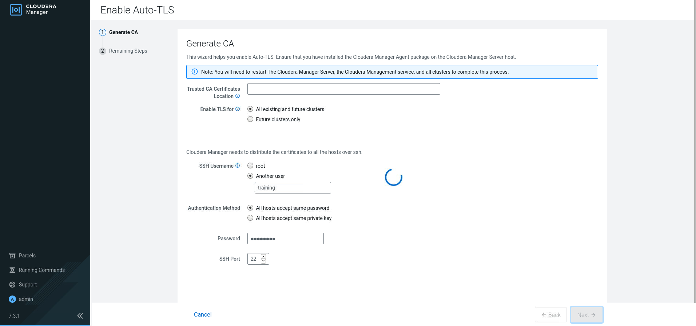
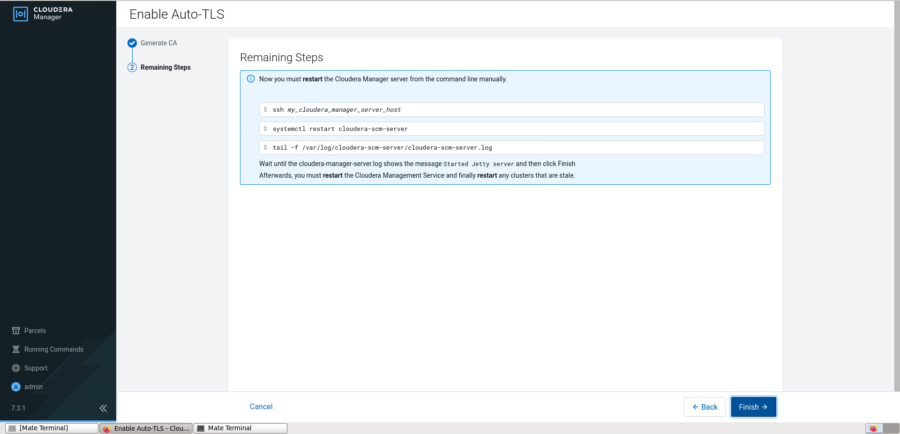
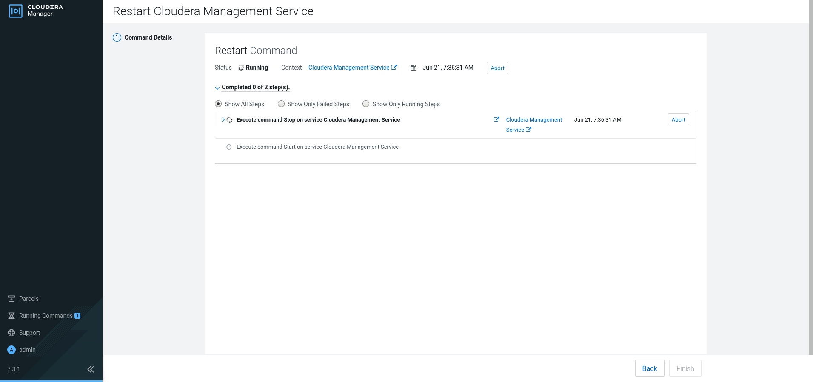
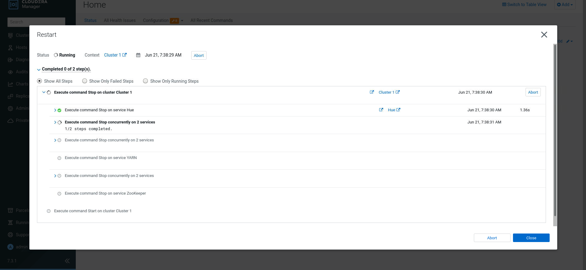

4. Auto TLS

[[toc]]

# 4. Auto TLS





```
sudo systemctl restart cloudera-scm-server
```

## In all hosts

Edit /etc/cloudera-scm-agent/config.ini

From

```
server_host=10.0.7.100
```
To

```
server_host=cmhost.example.com
```

And

```bash
systemctl restart cloudera-scm-agent
```
# Restar Cloudera Management Services



And restart Cluster and Apply config to end with the setup

