2. WebUI Install screeenshosts
3. 
- [2\. WebUI setup](#2-webui-setup)
    - [Welcome Screen](#welcome-screen)
    - [Name Cluster](#name-cluser)
    - [Import All host](#import-all-host)
    - [Repo to use](#repo-to-use)
    - [Use Cloudera OpenJDK](#use-cloudera-openjdk)
    - [Import credentials to SSH into hosts](#import-crendetial-to-ssh-into-hosts)
    - [Wait until complete the setup](#wait-until-complete-the-setup)
    - [Distribute the parcels](#distribute-the-parcels)
    - [Run host inspector](#run-host-inspector)
    - [Review the results](#review-the-results)
- [Services to include:](#services-to-include)
    - [Screenshosts setup](#screenshosts-setup)
    - [Roles](#roles)

# 2. WebUI setup

## Welcome Screen
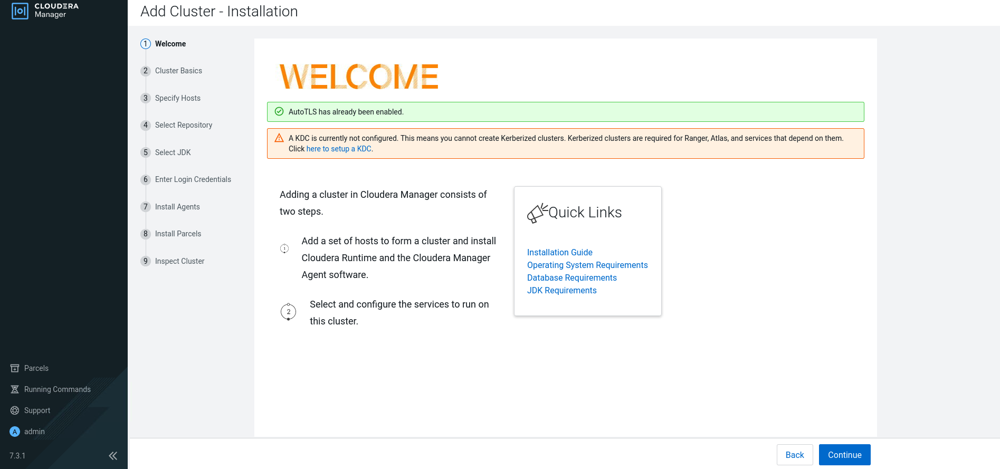

## Name Cluster
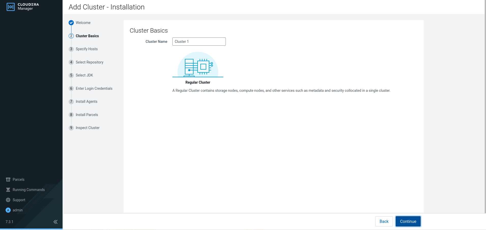

## Import All host	
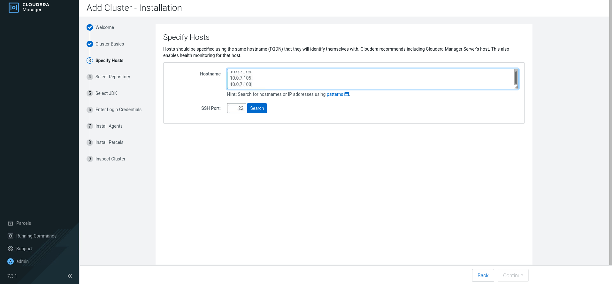

## Repo to use

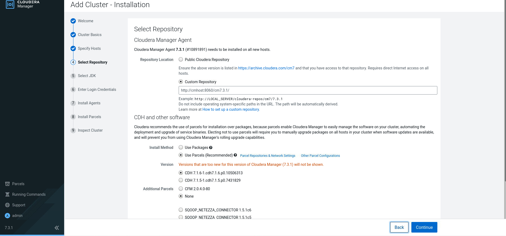

## Use Cloudera OpenJDK	

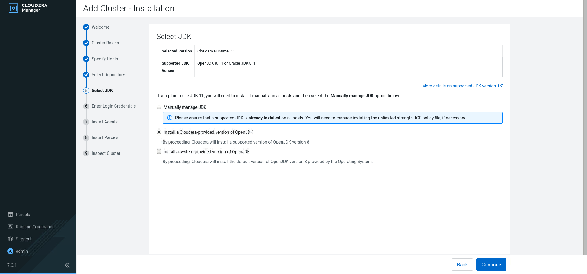

## Import credentials to SSH into hosts

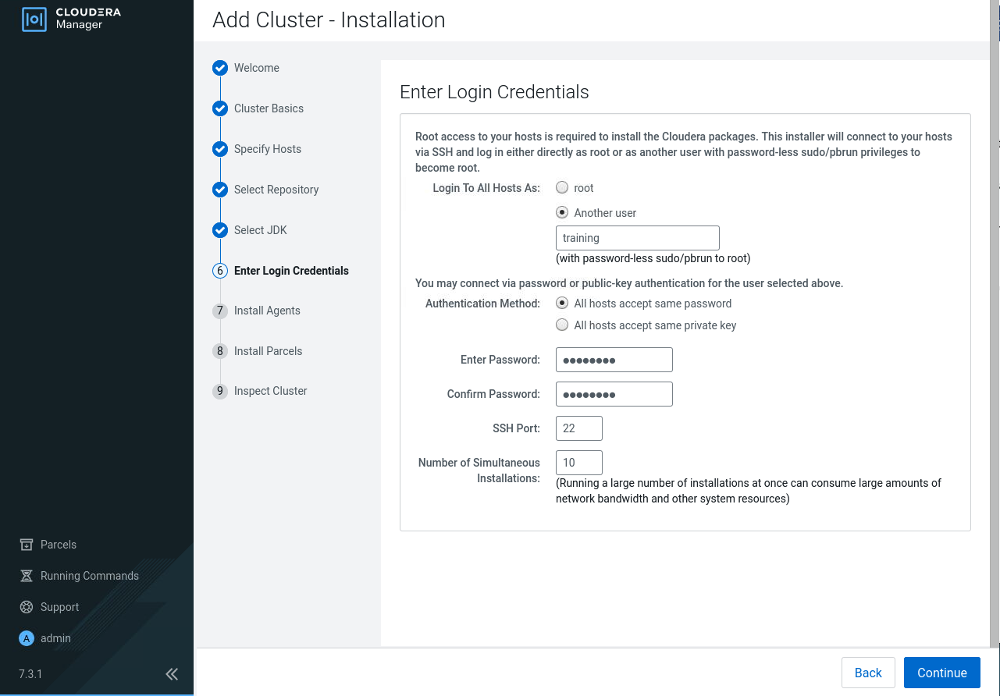

## Wait until complete the setup	

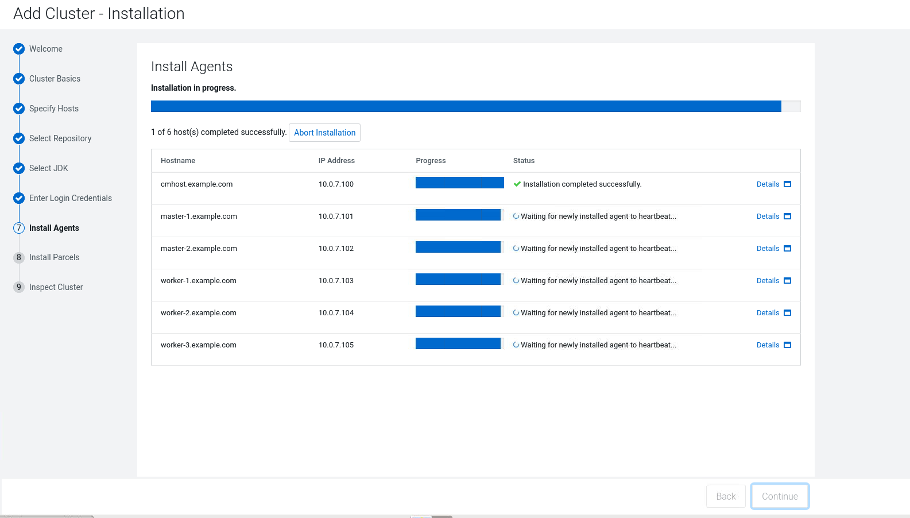

## Distribute the parcels

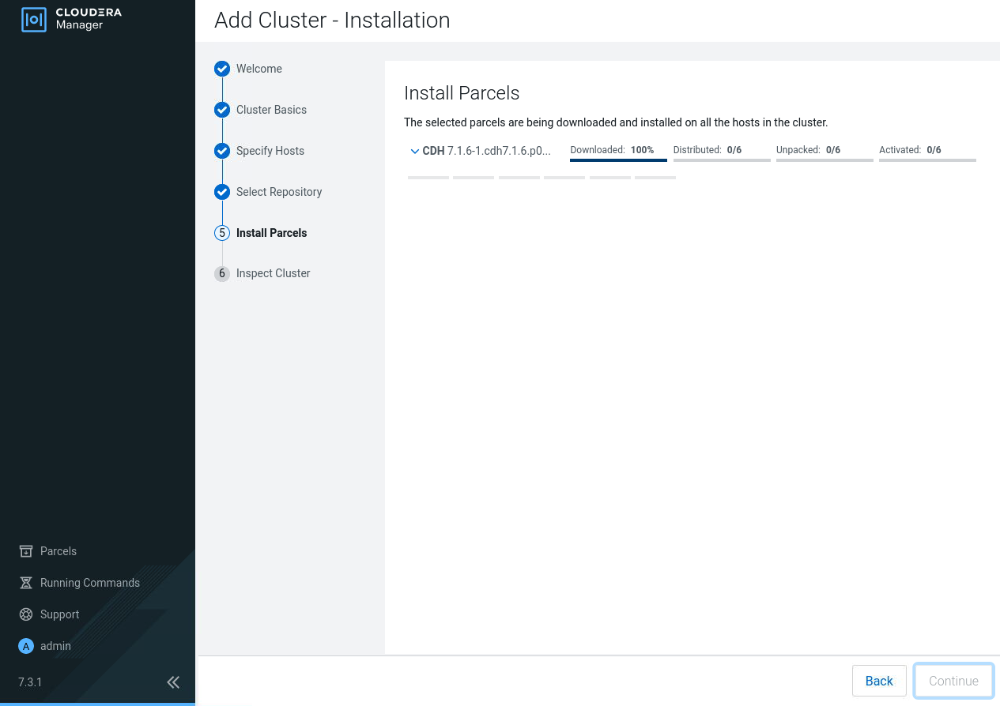

## Run host inspector

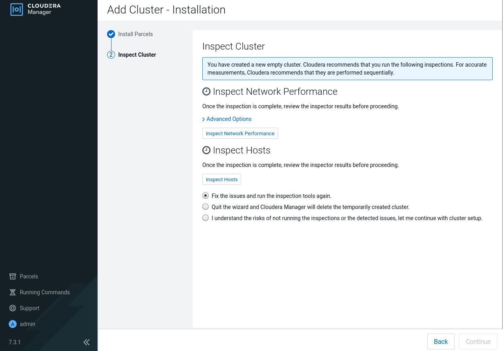

## Review the results

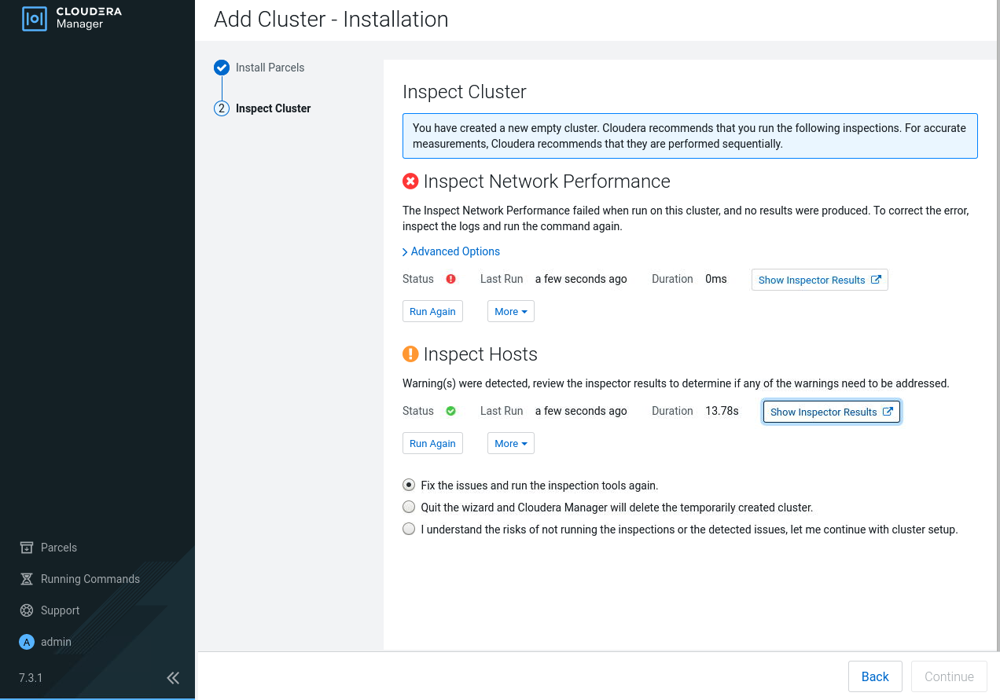

Some issues related to kudu, I will not use it soo it's safe to continue

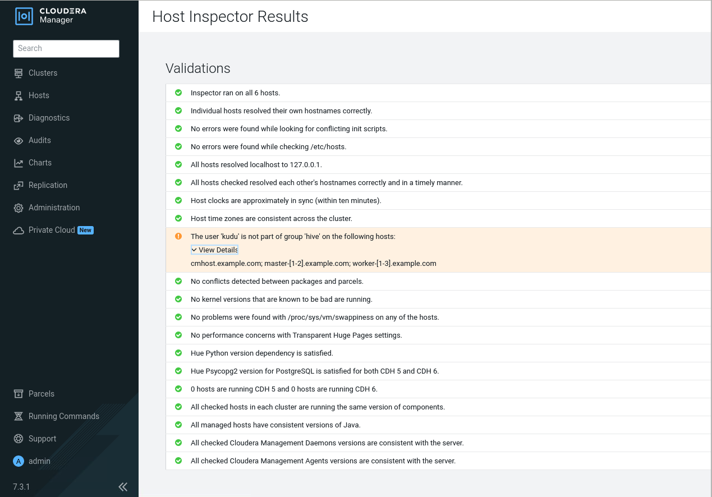

# Services to include: 
* Zookeeper
* HDFS
* YARN 
* YARN Queue Manager 
* Hive
* Spark (latest)
* Hue, 
* Impala

## Screenshosts setup

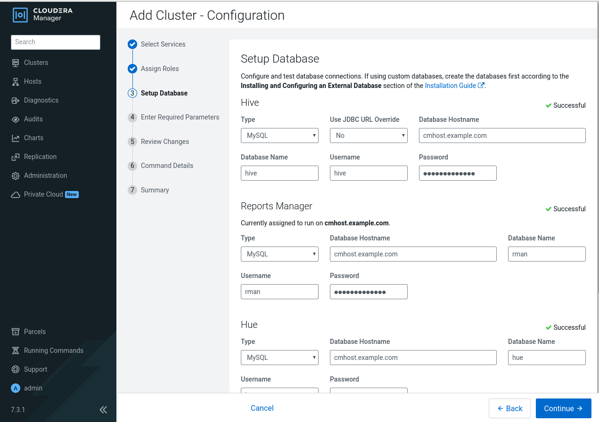

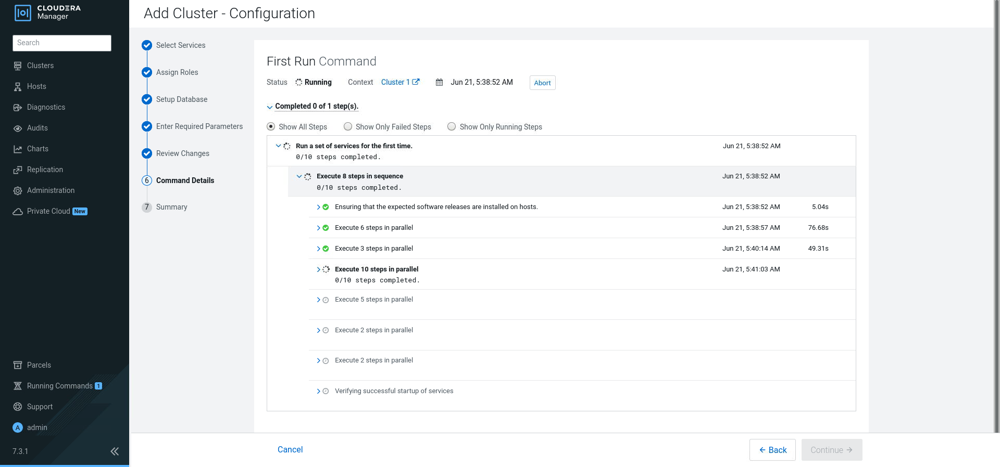

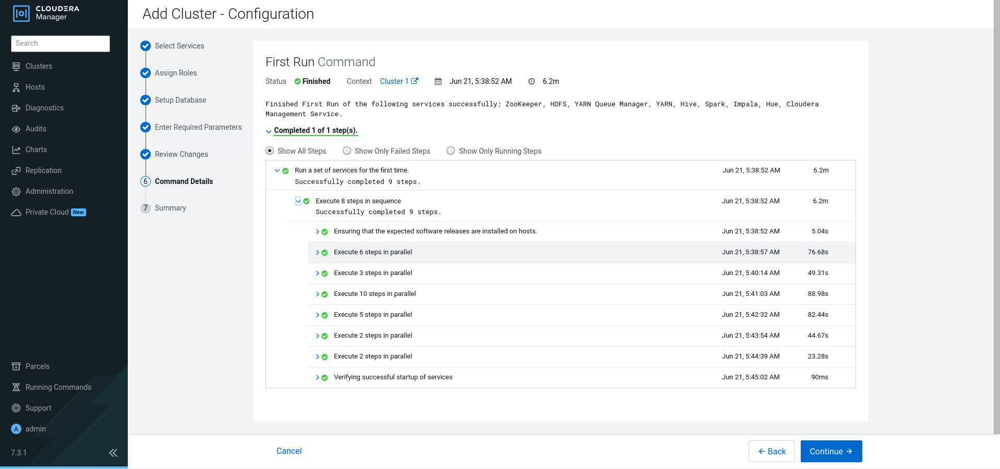

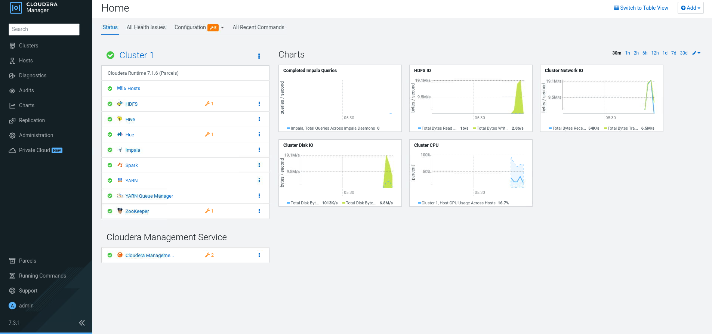

## Roles

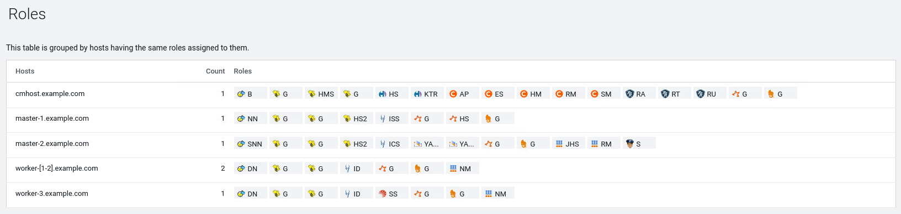
