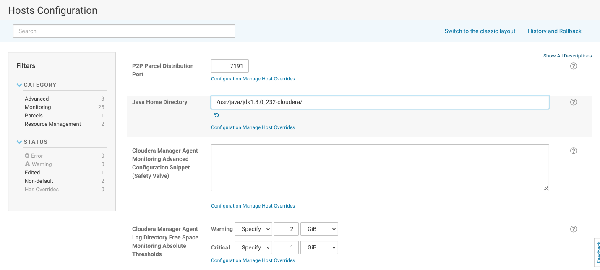
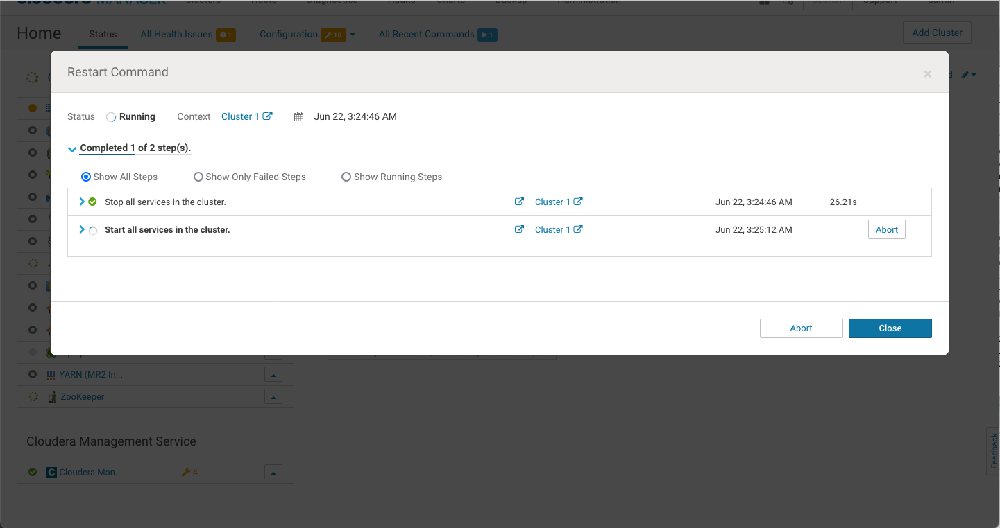
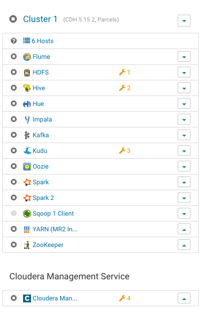

1. Requirements Cloudera Manager 

- [Requirements](#requierements)
    - [Verify OS](#verify-os)
    - [Cloudera Manager DB](#cloudera-manager-db)
    - [Java verision](#java-verison)
    - [Database Version](#database-version)
- [Before Upgrade](#before-upgrade)
    - [Upgrade Java in all nodes](#upgrade-java-in-all-nodes)
    - [Upgrade Java in Cloudera Config](#upgrade-java-in-cloudera-config)
    - [Upgrade Mysql in cmhost](#upgrade-mysql-in-cmhost)
        - [Backup](#backup)
        - [Stop and extra backup](#stop-and-extra-backup)
        - [Upgrade](#upgrade)

# Requirements

[https://docs.cloudera.com/cdp-private-cloud/latest/upgrade-cdh/topics/ug\_cm\_upgrade_before.html](https://docs.cloudera.com/cdp-private-cloud/latest/upgrade-cdh/topics/ug_cm_upgrade_before.html)

## Verify OS

```
lsb_release -a
LSB Version:	:core-4.1-amd64:core-4.1-noarch
Distributor ID:	CentOS
Description:	CentOS Linux release 7.6.1810 (Core)
Release:	7.6.1810
Codename:	Core
```

## Cloudera Manager DB

```
cat /etc/cloudera-scm-server/db.properties
# Auto-generated by scm_prepare_database.sh on Tue Jun 22 02:12:11 PDT 2021
#
# For information describing how to configure the Cloudera Manager Server
# to connect to databases, see the "Cloudera Manager Installation Guide."
#
com.cloudera.cmf.db.type=mysql
com.cloudera.cmf.db.host=localhost
com.cloudera.cmf.db.name=cmserver
com.cloudera.cmf.db.user=cmserveruser
com.cloudera.cmf.db.setupType=EXTERNAL
com.cloudera.cmf.db.password=password
```

## Java verison

```
java -version
java version "1.8.0_162"
Java(TM) SE Runtime Environment (build 1.8.0_162-b12)
Java HotSpot(TM) 64-Bit Server VM (build 25.162-b12, mixed mode)

```

## Database Version

```
rpm -qa | grep mysql
mysql-community-server-5.6.44-2.el7.x86_64
mysql-community-common-5.6.44-2.el7.x86_64
mysql-community-release-el7-5.noarch
mysql-community-client-5.6.44-2.el7.x86_64
mysql-community-libs-5.6.44-2.el7.x86_64
```

# Before Upgrade

- Upgrade Java version
- Upgrade Mysql Version

## Upgrade Java in all nodes

Plan to use the Java versión included into YUM cloudera yum repos

```
wget "https://archive.cloudera.com/p/cm7/7.3.1/redhat7/yum/RPMS/x86_64/openjdk8-8.0+232_9-cloudera.x86_64.rpm"
sudo yum localinstall openjdk8-8.0+232_9-cloudera.x86_64.rpm
``````
for i in $(awk '{print $3}' /etc/hosts | grep -v loc)
do
scp openjdk8-8.0+232_9-cloudera.x86_64.rpm $i:
done
``````
for i in $(awk '{print $3}' /etc/hosts | grep -v loc)
do
ssh  $i sudo yum localinstall -y openjdk8-8.0+232_9-cloudera.x86_64.rpm
done
```

## Upgrade Java in Cloudera Config

Add into /etc/default/cloudera-scm-server

```
export JAVA_HOME="/usr/java/jdk1.8.0_232-cloudera/"
```

Restart Cloudera Manager Server

```
sudo systemctl restart cloudera-scm-server
```



Restart cluster



## Upgrade Mysql in cmhost

Stop CM Services and clusters


### Backup

```
mysqldump -v -u root -p --all-databases > /tmp/mysql56_all_databases_dump.`date +%F`.sql 
```

### Stop and extra backup

```
sudo systemctl stop mysqld
sudo cp -r /var/lib/mysql /var/lib/mysql56.backup
```

### Upgrade

```
wget http://repo.mysql.com/mysql57-community-release-el7.rpm -P /tmp/
sudo yum localinstall /tmp/mysql57-community-release-el7.rpm
yum update mysql
```

If failed

```
mysqld.service - MySQL Server
   Loaded: loaded (/usr/lib/systemd/system/mysqld.service; enabled; vendor preset: disabled)
   Active: deactivating (final-sigterm) (Result: exit-code) since Tue 2021-06-22 03:50:19 PDT; 10min ago
     Docs: man:mysqld(8)
           http://dev.mysql.com/doc/refman/en/using-systemd.html
  Process: 13449 ExecStart=/usr/sbin/mysqld --daemonize --pid-file=/var/run/mysqld/mysqld.pid $MYSQLD_OPTS (code=exited, status=1/FAILURE)
  Process: 13427 ExecStartPre=/usr/bin/mysqld_pre_systemd (code=exited, status=0/SUCCESS)
 Main PID: 7123 (code=exited, status=0/SUCCESS)
   CGroup: /system.slice/mysqld.service
           └─13452 /usr/sbin/mysqld --daemonize --pid-file=/var/run/mysqld/mysqld.pid

Jun 22 04:00:42 cmhost mysqld[13449]: 2021-06-22T11:00:42.501553Z 0 [Note] InnoDB: Waiting for purge to start
Jun 22 04:00:42 cmhost mysqld[13449]: 2021-06-22T11:00:42.552153Z 0 [Note] InnoDB: 5.7.34 started; log se...07811
Jun 22 04:00:42 cmhost mysqld[13449]: 2021-06-22T11:00:42.552351Z 0 [Note] InnoDB: Loading buffer pool(s)..._pool
Jun 22 04:00:42 cmhost mysqld[13449]: 2021-06-22T11:00:42.552631Z 0 [Note] Plugin 'FEDERATED' is disabled.
Jun 22 04:00:42 cmhost mysqld[13449]: 2021-06-22T11:00:42.556701Z 0 [Note] InnoDB: Buffer pool(s) load co...00:42
Jun 22 04:00:42 cmhost mysqld[13449]: 2021-06-22T11:00:42.556839Z 0 [Warning] System table 'plugin' is ex...onal.
Jun 22 04:00:42 cmhost mysqld[13449]: 2021-06-22T11:00:42.557038Z 0 [ERROR] unknown variable 'key_buffer=16M'
Jun 22 04:00:42 cmhost mysqld[13449]: 2021-06-22T11:00:42.557045Z 0 [ERROR] Aborting
Jun 22 04:00:42 cmhost mysqld[13449]: 2021-06-22T11:00:42.557070Z 0 [Note] Binlog end
Jun 22 04:00:42 cmhost systemd[1]: mysqld.service: control process exited, code=exited status=1
Hint: Some lines were ellipsized, use -l to show in full.
``````
Jun 22 04:00:42 cmhost mysqld[13449]: 2021-06-22T11:00:42.557038Z 0 [ERROR] unknown variable 'key_buffer=16M'
```

**Comment key_buffer into /etc/my.cnf**

```
systemctl restart mysqld
mysql_upgrade -p
systemctl restart mysqld
systemctl status mysqld
```

All is fine

```
systemctl status mysqld
● mysqld.service - MySQL Server
   Loaded: loaded (/usr/lib/systemd/system/mysqld.service; enabled; vendor preset: disabled)
   Active: active (running) since Tue 2021-06-22 04:03:47 PDT; 4s ago
     Docs: man:mysqld(8)
           http://dev.mysql.com/doc/refman/en/using-systemd.html
  Process: 15522 ExecStart=/usr/sbin/mysqld --daemonize --pid-file=/var/run/mysqld/mysqld.pid $MYSQLD_OPTS (code=exited, status=0/SUCCESS)
  Process: 15500 ExecStartPre=/usr/bin/mysqld_pre_systemd (code=exited, status=0/SUCCESS)
 Main PID: 15526 (mysqld)
    Tasks: 30
   CGroup: /system.slice/mysqld.service
           └─15526 /usr/sbin/mysqld --daemonize --pid-file=/var/run/mysqld/mysqld.pid

Jun 22 04:03:47 cmhost mysqld[15522]: 2021-06-22T11:03:47.651464Z 0 [Note] Skipping generation of SSL cer...tory.
Jun 22 04:03:47 cmhost mysqld[15522]: 2021-06-22T11:03:47.652237Z 0 [Warning] CA certificate ca.pem is se...gned.
Jun 22 04:03:47 cmhost mysqld[15522]: 2021-06-22T11:03:47.652303Z 0 [Note] Skipping generation of RSA key...tory.
Jun 22 04:03:47 cmhost mysqld[15522]: 2021-06-22T11:03:47.652621Z 0 [Note] Server hostname (bind-address)... 3306
Jun 22 04:03:47 cmhost mysqld[15522]: 2021-06-22T11:03:47.653898Z 0 [Note] IPv6 is not available.
Jun 22 04:03:47 cmhost mysqld[15522]: 2021-06-22T11:03:47.653939Z 0 [Note]   - '0.0.0.0' resolves to '0.0.0.0';
Jun 22 04:03:47 cmhost mysqld[15522]: 2021-06-22T11:03:47.653967Z 0 [Note] Server socket created on IP: '...0.0'.
Jun 22 04:03:47 cmhost mysqld[15522]: 2021-06-22T11:03:47.682217Z 0 [Note] Event Scheduler: Loaded 0 events
Jun 22 04:03:47 cmhost mysqld[15522]: 2021-06-22T11:03:47.682389Z 0 [Note] /usr/sbin/mysqld: ready for co...ions.
Jun 22 04:03:47 cmhost systemd[1]: Started MySQL Server.
Hint: Some lines were ellipsized, use -l to show in full.
```