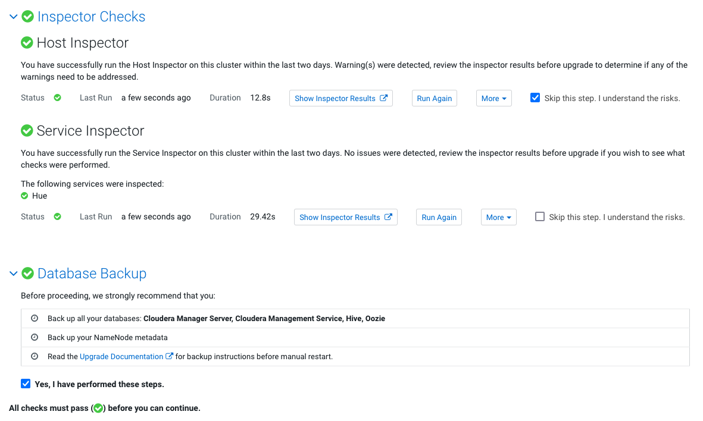

5. Upgrade from CDH to CDP Runtime

- [Prepare](#prepare)
    - [Download parcels](#download-parcels)
    - [Distribute](#distribute)
- [Upgrade Wizard](#upgrade-wizard)
    - [YARN Queue Manager has been added to the cluster.](#yarn-queue-manager-has-been-added-to-the-cluster)
    - [Add Tez](#add-tez)
    - [Add Hive on Tez](#add-hive-on-tez)
    - [Other Tasks](#other-tasks)
    - [Stop Cluster](#stop-cluster)
    - [Upgrade Process](#upgrade-process)
- [Test the cluster](#test-the-cluster)
    - [Impala](#impala)
    - [Hive](#hive)
    - [YARN](#yarn)
- [Finalize HDFS Upgrade](#finalize-hdfs-upgrade)

# Prepare

[https://docs.cloudera.com/cdp-private-cloud/latest/upgrade-cdh/topics/ug\_cdh\_upgrading_top.html](https://docs.cloudera.com/cdp-private-cloud/latest/upgrade-cdh/topics/ug_cdh_upgrading_top.html)

### Download parcels


### Distribute


# Upgrade Wizard


#### YARN Queue Manager has been added to the cluster.


```
/opt/cloudera/parcels/CDH-7.1.6-1.cdh7.1.6.p0.10506313/bin/yarn fs2cs --cluster-resource memory-mb=6790144,vcores=12 --no-terminal-rule-check -y yarn-site.xml -f fair-scheduler.xml -o output/
WARNING: YARN_OPTS has been replaced by HADOOP_OPTS. Using value of YARN_OPTS.
21/06/22 08:14:31 INFO conf.Configuration: resource-types.xml not found
21/06/22 08:14:31 INFO resource.ResourceUtils: Unable to find 'resource-types.xml'.
21/06/22 08:14:31 INFO converter.FSConfigToCSConfigConverter: Output directory for yarn-site.xml and capacity-scheduler.xml is: output/
21/06/22 08:14:31 INFO converter.FSConfigToCSConfigConverter: Conversion rules file is not defined, using default conversion config!
21/06/22 08:14:31 INFO converter.FSConfigToCSConfigRuleHandler: No rule set for maxCapacityPercentage.action, defaulting to WARNING
21/06/22 08:14:31 INFO converter.FSConfigToCSConfigRuleHandler: No rule set for maxChildCapacity.action, defaulting to WARNING
21/06/22 08:14:31 INFO converter.FSConfigToCSConfigRuleHandler: No rule set for maxResources.action, defaulting to WARNING
21/06/22 08:14:31 INFO converter.FSConfigToCSConfigRuleHandler: No rule set for minResources.action, defaulting to WARNING
21/06/22 08:14:31 INFO converter.FSConfigToCSConfigRuleHandler: No rule set for dynamicMaxAssign.action, defaulting to WARNING
21/06/22 08:14:31 INFO converter.FSConfigToCSConfigRuleHandler: No rule set for reservationSystem.action, defaulting to WARNING
21/06/22 08:14:31 INFO converter.FSConfigToCSConfigRuleHandler: No rule set for queueAutoCreate.action, defaulting to WARNING
21/06/22 08:14:31 INFO converter.FSConfigToCSConfigRuleHandler: No rule set for fairAsDrf.action, defaulting to WARNING
21/06/22 08:14:31 INFO converter.FSConfigToCSConfigRuleHandler: No rule set for queueDynamicCreate.action, defaulting to WARNING
21/06/22 08:14:31 INFO converter.FSConfigToCSConfigRuleHandler: No rule set for parentDynamicCreate.action, defaulting to WARNING
21/06/22 08:14:31 INFO converter.FSConfigToCSConfigRuleHandler: No rule set for childStaticDynamicConflict.action, defaulting to WARNING
21/06/22 08:14:31 INFO converter.FSConfigToCSConfigRuleHandler: No rule set for parentChildCreateDiff.action, defaulting to WARNING
21/06/22 08:14:31 INFO converter.FSConfigToCSConfigConverter: Using explicitly defined fair-scheduler.xml
21/06/22 08:14:31 INFO security.YarnAuthorizationProvider: org.apache.hadoop.yarn.security.ConfiguredYarnAuthorizer is instantiated.
21/06/22 08:14:31 INFO scheduler.AbstractYarnScheduler: Minimum allocation = <memory:1024, vCores:1>
21/06/22 08:14:31 INFO scheduler.AbstractYarnScheduler: Maximum allocation = <memory:2543, vCores:4>
21/06/22 08:14:31 INFO placement.PlacementFactory: Creating PlacementRule implementation: class org.apache.hadoop.yarn.server.resourcemanager.placement.SpecifiedPlacementRule
21/06/22 08:14:31 INFO placement.PlacementFactory: Creating PlacementRule implementation: class org.apache.hadoop.yarn.server.resourcemanager.placement.UserPlacementRule
21/06/22 08:14:31 WARN fair.AllocationFileLoaderService: fair-scheduler.xml not found on the classpath.
21/06/22 08:14:31 INFO converter.FSConfigToCSConfigConverter: Converting placement rules
21/06/22 08:14:32 INFO scheduler.AbstractYarnScheduler: Minimum allocation = <memory:1024, vCores:1>
21/06/22 08:14:32 INFO scheduler.AbstractYarnScheduler: Maximum allocation = <memory:2543, vCores:4>
21/06/22 08:14:32 INFO capacity.ParentQueue: root, capacity=1.0, absoluteCapacity=1.0, maxCapacity=1.0, absoluteMaxCapacity=1.0, state=RUNNING, acls=ADMINISTER_QUEUE:*SUBMIT_APP:*, labels=*,
, reservationsContinueLooking=true, orderingPolicy=utilization, priority=0, allowZeroCapacitySum=false
21/06/22 08:14:32 INFO capacity.ParentQueue: Initialized parent-queue root name=root, fullname=root
21/06/22 08:14:32 INFO capacity.LeafQueue: Initializing root.default
capacity = 0.0 [= (float) configuredCapacity / 100 ]
absoluteCapacity = 0.0 [= parentAbsoluteCapacity * capacity ]
maxCapacity = 1.0 [= configuredMaxCapacity ]
absoluteMaxCapacity = 1.0 [= 1.0 maximumCapacity undefined, (parentAbsoluteMaxCapacity * maximumCapacity) / 100 otherwise ]
effectiveMinResource=<memory:0, vCores:0>
 , effectiveMaxResource=<memory:0, vCores:0>
userLimit = 100 [= configuredUserLimit ]
userLimitFactor = 1.0 [= configuredUserLimitFactor ]
maxApplications = -1 [= configuredMaximumSystemApplicationsPerQueue or (int)(configuredMaximumSystemApplications * absoluteCapacity)]
maxApplicationsPerUser = 0 [= (int)(maxApplications * (userLimit / 100.0f) * userLimitFactor) ]
maxParallelApps = 2147483647
usedCapacity = 0.0 [= usedResourcesMemory / (clusterResourceMemory * absoluteCapacity)]
absoluteUsedCapacity = 0.0 [= usedResourcesMemory / clusterResourceMemory]
maxAMResourcePerQueuePercent = 0.5 [= configuredMaximumAMResourcePercent ]
minimumAllocationFactor = 0.875 [= (float)(maximumAllocationMemory - minimumAllocationMemory) / maximumAllocationMemory ]
maximumAllocation = <memory:8192, vCores:4> [= configuredMaxAllocation ]
numContainers = 0 [= currentNumContainers ]
state = RUNNING [= configuredState ]
acls = ADMINISTER_QUEUE: SUBMIT_APP:  [= configuredAcls ]
nodeLocalityDelay = 40
rackLocalityAdditionalDelay = -1
labels=*,
reservationsContinueLooking = true
preemptionDisabled = true
defaultAppPriorityPerQueue = 0
priority = 0
maxLifetime = -1 seconds
defaultLifetime = -1 seconds
21/06/22 08:14:32 INFO capacity.CapacitySchedulerQueueManager: Initialized queue: root.default
21/06/22 08:14:32 INFO capacity.CapacitySchedulerQueueManager: Initialized queue: root
21/06/22 08:14:32 INFO capacity.CapacitySchedulerQueueManager: Initialized root queue root: numChildQueue= 1, capacity=1.0, absoluteCapacity=1.0, usedResources=<memory:0, vCores:0>usedCapacity=0.0, numApps=0, numContainers=0
21/06/22 08:14:32 INFO placement.CSMappingPlacementRule: Initializing CSMappingPlacementRule queue mapping manager.
21/06/22 08:14:32 INFO capacity.CapacitySchedulerConfiguration: Reading mapping rules from provided inline JSON '{
  "rules" : [ {
    "type" : "user",
    "matches" : "*",
    "policy" : "specified",
    "fallbackResult" : "skip",
    "create" : true
  }, {
    "type" : "user",
    "matches" : "*",
    "policy" : "user",
    "parentQueue" : "root",
    "fallbackResult" : "skip",
    "create" : true
  } ]
}'.
21/06/22 08:14:32 INFO placement.CSMappingPlacementRule: Initialized queue mappings, can override user specified queues: true  number of rules: 2 mapping rules: [MappingRule{matcher=MatchAllMatcher, action=PlaceToQueueAction{queueName='%specified'}}, MappingRule{matcher=MatchAllMatcher, action=PlaceToQueueAction{queueName='root.%user'}}]
21/06/22 08:14:32 INFO capacity.WorkflowPriorityMappingsManager: Initialized workflow priority mappings, override: false
21/06/22 08:14:32 INFO capacity.CapacityScheduler: Initialized CapacityScheduler with calculator=class org.apache.hadoop.yarn.util.resource.DefaultResourceCalculator, minimumAllocation=<<memory:1024, vCores:1>>, maximumAllocation=<<memory:2543, vCores:4>>, asynchronousScheduling=false, asyncScheduleInterval=5ms,multiNodePlacementEnabled=false
21/06/22 08:14:32 INFO converter.ConvertedConfigValidator: Capacity scheduler was successfully started
21/06/22 08:14:32 INFO activities.ActivitiesManager: org.apache.hadoop.yarn.server.resourcemanager.scheduler.activities.ActivitiesManager thread interrupted
```


### Add Tez


### Add Hive on Tez


### Other Tasks




## Stop Cluster


## Upgrade Process


# Test the cluster


### Impala

```
[worker-1:21000] default> select count(*) from web_logs;
Query: select count(*) from web_logs
Query submitted at: 2021-06-22 23:31:37 (Coordinator: http://worker-1.example.com:25000)
Query progress can be monitored at: http://worker-1.example.com:25000/query_plan?query_id=574d0dc5cb170246:c7f233df00000000
+----------+
| count(*) |
+----------+
| 1000     |
+----------+
Fetched 1 row(s) in 1.60s
```

### Hive

```
select count(*) from web_logs;
INFO  : Compiling command(queryId=hive_20210623000534_0caeea9f-e0b3-42ba-bfd6-b518451fa106): select count(*) from web_logs
INFO  : Semantic Analysis Completed (retrial = false)
INFO  : Created Hive schema: Schema(fieldSchemas:[FieldSchema(name:_c0, type:bigint, comment:null)], properties:null)
INFO  : Completed compiling command(queryId=hive_20210623000534_0caeea9f-e0b3-42ba-bfd6-b518451fa106); Time taken: 3.555 seconds
INFO  : Executing command(queryId=hive_20210623000534_0caeea9f-e0b3-42ba-bfd6-b518451fa106): select count(*) from web_logs
INFO  : Query ID = hive_20210623000534_0caeea9f-e0b3-42ba-bfd6-b518451fa106
INFO  : Total jobs = 1
INFO  : Launching Job 1 out of 1
INFO  : Starting task [Stage-1:MAPRED] in serial mode
INFO  : Subscribed to counters: [] for queryId: hive_20210623000534_0caeea9f-e0b3-42ba-bfd6-b518451fa106
INFO  : Session is already open
INFO  : Dag name: select count(*) from web_logs (Stage-1)
INFO  : Tez session was closed. Reopening...
INFO  : Session re-established.
INFO  : Session re-established.
INFO  : Status: Running (Executing on YARN cluster with App id application_1624375778673_0007)

----------------------------------------------------------------------------------------------
        VERTICES      MODE        STATUS  TOTAL  COMPLETED  RUNNING  PENDING  FAILED  KILLED
----------------------------------------------------------------------------------------------
Map 1 .......... container     SUCCEEDED      1          1        0        0       0       0
Reducer 2 ...... container     SUCCEEDED      1          1        0        0       0       0
----------------------------------------------------------------------------------------------
VERTICES: 02/02  [==========================>>] 100%  ELAPSED TIME: 5.14 s
----------------------------------------------------------------------------------------------
INFO  : Status: DAG finished successfully in 4.99 seconds
INFO  :
INFO  : Query Execution Summary
INFO  : ----------------------------------------------------------------------------------------------
INFO  : OPERATION                            DURATION
INFO  : ----------------------------------------------------------------------------------------------
INFO  : Compile Query                           3.56s
INFO  : Prepare Plan                            0.41s
INFO  : Get Query Coordinator (AM)              0.02s
INFO  : Submit Plan                             3.79s
INFO  : Start DAG                               0.05s
INFO  : Run DAG                                 4.99s
INFO  : ----------------------------------------------------------------------------------------------
INFO  :
INFO  : Task Execution Summary
INFO  : ----------------------------------------------------------------------------------------------
INFO  :   VERTICES      DURATION(ms)   CPU_TIME(ms)    GC_TIME(ms)   INPUT_RECORDS   OUTPUT_RECORDS
INFO  : ----------------------------------------------------------------------------------------------
INFO  :      Map 1           1940.00          4,720             57             250                1
INFO  :  Reducer 2              1.00            590              8               1                0
INFO  : ----------------------------------------------------------------------------------------------
INFO  :
INFO  : org.apache.tez.common.counters.DAGCounter:
INFO  :    NUM_SUCCEEDED_TASKS: 2
INFO  :    TOTAL_LAUNCHED_TASKS: 2
INFO  :    RACK_LOCAL_TASKS: 1
INFO  :    AM_CPU_MILLISECONDS: 2300
INFO  :    AM_GC_TIME_MILLIS: 24
INFO  : File System Counters:
INFO  :    FILE_BYTES_READ: 59
INFO  :    FILE_BYTES_WRITTEN: 59
INFO  :    HDFS_BYTES_READ: 414157
INFO  :    HDFS_BYTES_WRITTEN: 104
INFO  :    HDFS_READ_OPS: 6
INFO  :    HDFS_WRITE_OPS: 2
INFO  :    HDFS_OP_CREATE: 1
INFO  :    HDFS_OP_GET_FILE_STATUS: 2
INFO  :    HDFS_OP_OPEN: 4
INFO  :    HDFS_OP_RENAME: 1
INFO  : org.apache.tez.common.counters.TaskCounter:
INFO  :    SPILLED_RECORDS: 0
INFO  :    NUM_SHUFFLED_INPUTS: 1
INFO  :    NUM_FAILED_SHUFFLE_INPUTS: 0
INFO  :    GC_TIME_MILLIS: 65
INFO  :    TASK_DURATION_MILLIS: 2199
INFO  :    CPU_MILLISECONDS: 5310
INFO  :    PHYSICAL_MEMORY_BYTES: 528482304
INFO  :    VIRTUAL_MEMORY_BYTES: 5511155712
INFO  :    COMMITTED_HEAP_BYTES: 528482304
INFO  :    INPUT_RECORDS_PROCESSED: 1001
INFO  :    INPUT_SPLIT_LENGTH_BYTES: 414157
INFO  :    OUTPUT_RECORDS: 1
INFO  :    OUTPUT_LARGE_RECORDS: 0
INFO  :    OUTPUT_BYTES: 5
INFO  :    OUTPUT_BYTES_WITH_OVERHEAD: 13
INFO  :    OUTPUT_BYTES_PHYSICAL: 51
INFO  :    ADDITIONAL_SPILLS_BYTES_WRITTEN: 0
INFO  :    ADDITIONAL_SPILLS_BYTES_READ: 0
INFO  :    ADDITIONAL_SPILL_COUNT: 0
INFO  :    SHUFFLE_BYTES: 27
INFO  :    SHUFFLE_BYTES_DECOMPRESSED: 13
INFO  :    SHUFFLE_BYTES_TO_MEM: 0
INFO  :    SHUFFLE_BYTES_TO_DISK: 0
INFO  :    SHUFFLE_BYTES_DISK_DIRECT: 27
INFO  :    SHUFFLE_PHASE_TIME: 51
INFO  :    FIRST_EVENT_RECEIVED: 41
INFO  :    LAST_EVENT_RECEIVED: 41
INFO  :    DATA_BYTES_VIA_EVENT: 0
INFO  : HIVE:
INFO  :    CREATED_FILES: 1
INFO  :    DESERIALIZE_ERRORS: 0
INFO  :    RECORDS_IN_Map_1: 250
INFO  :    RECORDS_OUT_0: 1
INFO  :    RECORDS_OUT_INTERMEDIATE_Map_1: 1
INFO  :    RECORDS_OUT_INTERMEDIATE_Reducer_2: 0
INFO  :    RECORDS_OUT_OPERATOR_FS_11: 1
INFO  :    RECORDS_OUT_OPERATOR_GBY_10: 1
INFO  :    RECORDS_OUT_OPERATOR_GBY_8: 1
INFO  :    RECORDS_OUT_OPERATOR_MAP_0: 0
INFO  :    RECORDS_OUT_OPERATOR_RS_9: 1
INFO  :    RECORDS_OUT_OPERATOR_SEL_7: 1000
INFO  :    RECORDS_OUT_OPERATOR_TS_0: 1000
INFO  : TaskCounter_Map_1_INPUT_web_logs:
INFO  :    INPUT_RECORDS_PROCESSED: 1000
INFO  :    INPUT_SPLIT_LENGTH_BYTES: 414157
INFO  : TaskCounter_Map_1_OUTPUT_Reducer_2:
INFO  :    ADDITIONAL_SPILLS_BYTES_READ: 0
INFO  :    ADDITIONAL_SPILLS_BYTES_WRITTEN: 0
INFO  :    ADDITIONAL_SPILL_COUNT: 0
INFO  :    DATA_BYTES_VIA_EVENT: 0
INFO  :    OUTPUT_BYTES: 5
INFO  :    OUTPUT_BYTES_PHYSICAL: 51
INFO  :    OUTPUT_BYTES_WITH_OVERHEAD: 13
INFO  :    OUTPUT_LARGE_RECORDS: 0
INFO  :    OUTPUT_RECORDS: 1
INFO  :    SPILLED_RECORDS: 0
INFO  : TaskCounter_Reducer_2_INPUT_Map_1:
INFO  :    FIRST_EVENT_RECEIVED: 41
INFO  :    INPUT_RECORDS_PROCESSED: 1
INFO  :    LAST_EVENT_RECEIVED: 41
INFO  :    NUM_FAILED_SHUFFLE_INPUTS: 0
INFO  :    NUM_SHUFFLED_INPUTS: 1
INFO  :    SHUFFLE_BYTES: 27
INFO  :    SHUFFLE_BYTES_DECOMPRESSED: 13
INFO  :    SHUFFLE_BYTES_DISK_DIRECT: 27
INFO  :    SHUFFLE_BYTES_TO_DISK: 0
INFO  :    SHUFFLE_BYTES_TO_MEM: 0
INFO  :    SHUFFLE_PHASE_TIME: 51
INFO  : TaskCounter_Reducer_2_OUTPUT_out_Reducer_2:
----------------------------------------------------------------------------------------------
        VERTICES      MODE        STATUS  TOTAL  COMPLETED  RUNNING  PENDING  FAILED  KILLED
----------------------------------------------------------------------------------------------
Map 1 .......... container     SUCCEEDED      1          1        0        0       0       0
Reducer 2 ...... container     SUCCEEDED      1          1        0        0       0       0
----------------------------------------------------------------------------------------------
VERTICES: 02/02  [==========================>>] 100%  ELAPSED TIME: 5.21 s
----------------------------------------------------------------------------------------------
+-------+
|  _c0  |
+-------+
| 1000  |
+-------+
1 row selected (13.248 seconds)
```

### YARN

```
yarn jar /opt/cloudera/parcels/CDH/lib/hadoop-mapreduce/hadoop-mapreduce-examples.jar pi 10 100
WARNING: YARN_OPTS has been replaced by HADOOP_OPTS. Using value of YARN_OPTS.
Number of Maps  = 10
Samples per Map = 100
Wrote input for Map #0
Wrote input for Map #1
Wrote input for Map #2
Wrote input for Map #3
Wrote input for Map #4
Wrote input for Map #5
Wrote input for Map #6
Wrote input for Map #7
Wrote input for Map #8
Wrote input for Map #9
Starting Job
21/06/23 00:07:28 INFO client.RMProxy: Connecting to ResourceManager at master-1.example.com/10.0.0.111:8032
21/06/23 00:07:29 INFO mapreduce.JobResourceUploader: Disabling Erasure Coding for path: /user/training/.staging/job_1624375778673_0008
21/06/23 00:07:29 INFO input.FileInputFormat: Total input files to process : 10
21/06/23 00:07:29 INFO mapreduce.JobSubmitter: number of splits:10
21/06/23 00:07:29 INFO mapreduce.JobSubmitter: Submitting tokens for job: job_1624375778673_0008
21/06/23 00:07:29 INFO mapreduce.JobSubmitter: Executing with tokens: []
21/06/23 00:07:29 INFO conf.Configuration: resource-types.xml not found
21/06/23 00:07:29 INFO resource.ResourceUtils: Unable to find 'resource-types.xml'.
21/06/23 00:07:29 INFO impl.YarnClientImpl: Submitted application application_1624375778673_0008
21/06/23 00:07:29 INFO mapreduce.Job: The url to track the job: http://master-1.example.com:8088/proxy/application_1624375778673_0008/
21/06/23 00:07:29 INFO mapreduce.Job: Running job: job_1624375778673_0008
21/06/23 00:07:40 INFO mapreduce.Job: Job job_1624375778673_0008 running in uber mode : false
21/06/23 00:07:40 INFO mapreduce.Job:  map 0% reduce 0%
21/06/23 00:07:49 INFO mapreduce.Job:  map 10% reduce 0%
21/06/23 00:07:52 INFO mapreduce.Job:  map 20% reduce 0%
21/06/23 00:07:55 INFO mapreduce.Job:  map 30% reduce 0%
21/06/23 00:07:58 INFO mapreduce.Job:  map 40% reduce 0%
21/06/23 00:08:01 INFO mapreduce.Job:  map 50% reduce 0%
21/06/23 00:08:05 INFO mapreduce.Job:  map 60% reduce 0%
21/06/23 00:08:08 INFO mapreduce.Job:  map 70% reduce 0%
21/06/23 00:08:11 INFO mapreduce.Job:  map 80% reduce 0%
21/06/23 00:08:14 INFO mapreduce.Job:  map 90% reduce 0%
21/06/23 00:08:18 INFO mapreduce.Job:  map 100% reduce 0%
21/06/23 00:08:23 INFO mapreduce.Job:  map 100% reduce 100%
21/06/23 00:08:24 INFO mapreduce.Job: Job job_1624375778673_0008 completed successfully
21/06/23 00:08:24 INFO mapreduce.Job: Counters: 55
    File System Counters
        FILE: Number of bytes read=91
        FILE: Number of bytes written=2695882
        FILE: Number of read operations=0
        FILE: Number of large read operations=0
        FILE: Number of write operations=0
        HDFS: Number of bytes read=2690
        HDFS: Number of bytes written=215
        HDFS: Number of read operations=45
        HDFS: Number of large read operations=0
        HDFS: Number of write operations=3
        HDFS: Number of bytes read erasure-coded=0
    Job Counters
        Killed reduce tasks=1
        Launched map tasks=10
        Launched reduce tasks=2
        Data-local map tasks=10
        Total time spent by all maps in occupied slots (ms)=56972
        Total time spent by all reduces in occupied slots (ms)=3069
        Total time spent by all map tasks (ms)=28486
        Total time spent by all reduce tasks (ms)=3069
        Total vcore-milliseconds taken by all map tasks=28486
        Total vcore-milliseconds taken by all reduce tasks=3069
        Total megabyte-milliseconds taken by all map tasks=58339328
        Total megabyte-milliseconds taken by all reduce tasks=3142656
    Map-Reduce Framework
        Map input records=10
        Map output records=20
        Map output bytes=180
        Map output materialized bytes=340
        Input split bytes=1510
        Combine input records=0
        Combine output records=0
        Reduce input groups=2
        Reduce shuffle bytes=340
        Reduce input records=20
        Reduce output records=0
        Spilled Records=40
        Shuffled Maps =10
        Failed Shuffles=0
        Merged Map outputs=10
        GC time elapsed (ms)=611
        CPU time spent (ms)=6890
        Physical memory (bytes) snapshot=5543772160
        Virtual memory (bytes) snapshot=32957542400
        Total committed heap usage (bytes)=5230821376
        Peak Map Physical memory (bytes)=544555008
        Peak Map Virtual memory (bytes)=3013730304
        Peak Reduce Physical memory (bytes)=244092928
        Peak Reduce Virtual memory (bytes)=2827726848
    Shuffle Errors
        BAD_ID=0
        CONNECTION=0
        IO_ERROR=0
        WRONG_LENGTH=0
        WRONG_MAP=0
        WRONG_REDUCE=0
    File Input Format Counters
        Bytes Read=1180
    File Output Format Counters
        Bytes Written=97
Job Finished in 55.574 seconds
Estimated value of Pi is 3.14800000000000000000
```

# Finalize HDFS Upgrade


