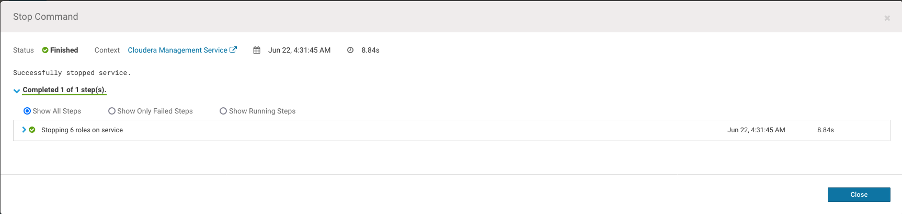
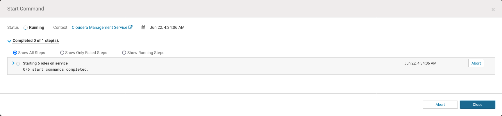
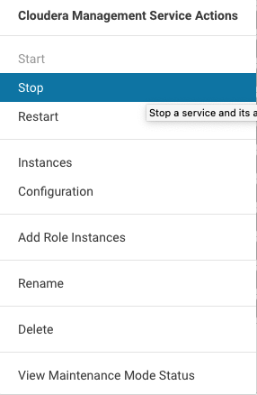

2. Backup Pre Upgrade CM

# In all hosts Backup Cloudera Manager Agent

```
cat backup.sh
#bin/bash
export CM_BACKUP_DIR="/tmp/backup/`date +%F`-CM"
echo $CM_BACKUP_DIR
mkdir -p $CM_BACKUP_DIR

sudo -E tar -cf $CM_BACKUP_DIR/cloudera-scm-agent.tar --exclude=*.sock /etc/cloudera-scm-agent /etc/default/cloudera-scm-agent /var/run/cloudera-scm-agent /var/lib/cloudera-scm-agent
sudo tar -cf $CM_BACKUP_DIR/repository.tar /etc/yum.repos.d

```

```
for i in $(awk '{print $3}' /etc/hosts | grep -v loc)
do
scp backup.sh $i:
done


for i in $(awk '{print $3}' /etc/hosts | grep -v loc)
do
ssh  $i bash -x backup.sh
done

for i in $(awk '{print $3}' /etc/hosts | grep -v loc)
do
ssh $i ls /tmp/backup/
done
```

# Cloudera Management Services

### Stop



And Run in the apropiate node, in this case all on CMHOST

```
sudo cp -rp /var/lib/cloudera-service-monitor /var/lib/cloudera-service-monitor-`date +%F`-CM
sudo cp -rp /var/lib/cloudera-host-monitor /var/lib/cloudera-host-monitor-`date +%F`-CM
sudo cp -rp /var/lib/cloudera-scm-eventserver /var/lib/cloudera-scm-eventserver-`date +%F`-CM
```

### Start




# Backup SCM Database

### Stop Cloudera Management Services



### Stop Cloudera Manager Server

```
sudo systemctl stop cloudera-scm-server
```


### Backup DB

```
mysqldump --databases cmserver  -u root -p > /tmp/backup/cmserver-backup-`date +%F`-CM.sql
```