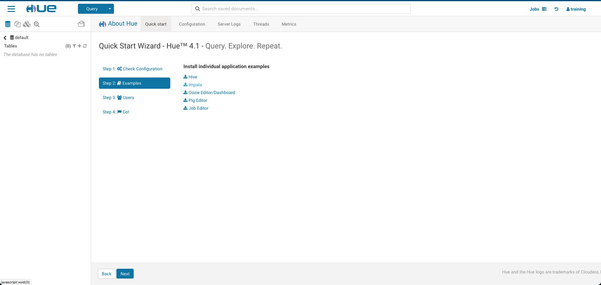
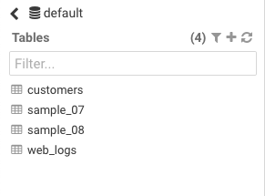
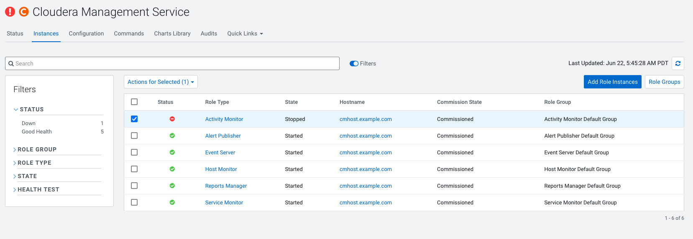
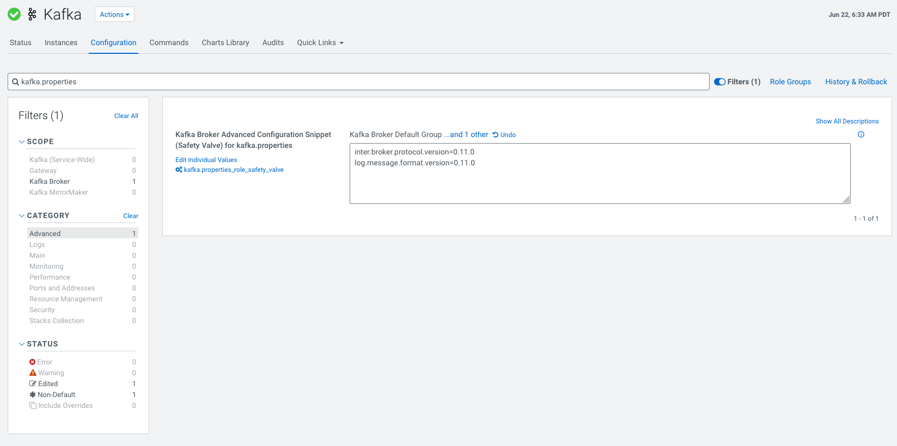
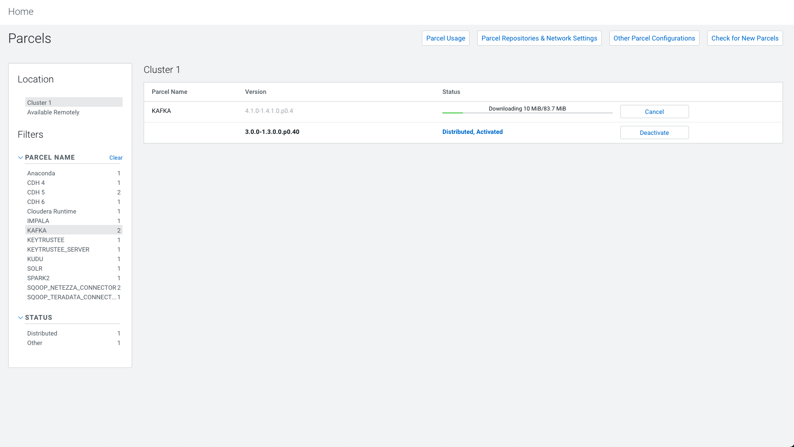
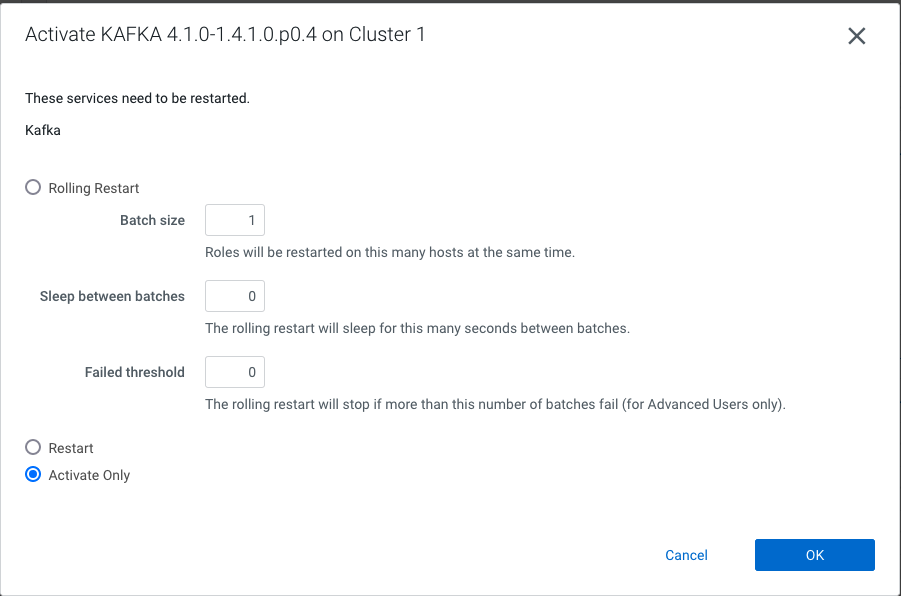
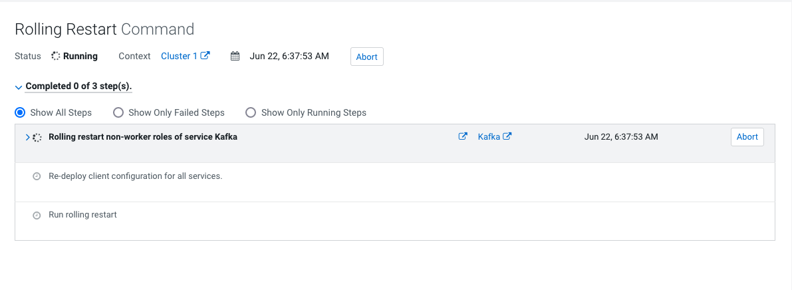
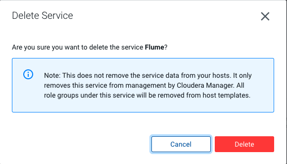
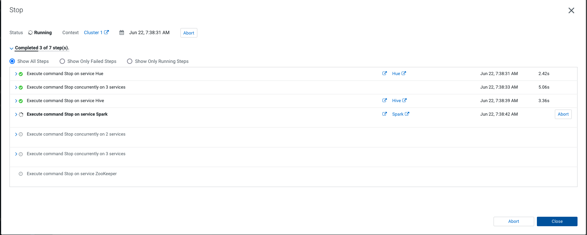
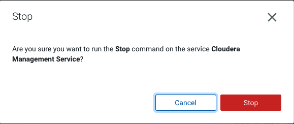

4. Pre Upgrade

[[TOC]]

# Load some data

Using hue load examples





# Remove Activity Monitor




# Upgrade Kafka

[https://docs.cloudera.com/documentation/kafka/latest/topics/kafka\_installing.html#concept\_wf3\_r3x\_4cb](https://docs.cloudera.com/documentation/kafka/latest/topics/kafka_installing.html#concept_wf3_r3x_4cb)

## Set version

Add the following properties to the Kafka Broker Advanced Configuration Snippet (Safety Valve) for kafka.properties:

To upgrade from CDK 3.0.x to CDK 4.1.x, enter:

inter.broker.protocol.version=0.11.0
log.message.format.version=0.11.0



## Download Parcels



## Distrube


## Activate



## Rolling Restart



# Remove Flume and Spark2



# Backup

### Stop the cluster





```
systemctl stop cloudera-scm-server
```

### Backup all Mysql DB

```
mysqldump --all-databases  -p | gzip  > /tmp/backup/pre-cdh-to-cdp-upgrade.sql.gz
Enter password:
```
### Backup Zookeeper

```
cp -rp /var/lib/zookeeper/ /var/lib/zookeeper-backup-`date +%F`CM5.16-CDH6.3.3
```


### Backup HDFS

#### ON JN

```
cp -rp /dfs/jn /dfs/jn-CM5.16-CDH6.3.3
```

#### ON NN
```
mkdir -p /etc/hadoop/conf.rollback.namenode
cd /var/run/cloudera-scm-agent/process/ && cd `ls -t1 | grep -e "-NAMENODE\$" | head -1`
cp -rp * /etc/hadoop/conf.rollback.namenode/
rm -rf /etc/hadoop/conf.rollback.namenode/log4j.properties
cp -rp /etc/hadoop/conf.cloudera.hdfs/log4j.properties /etc/hadoop/conf.rollback.namenode/
```

#### ON DN

```
mkdir -p /etc/hadoop/conf.rollback.datanode/
cd /var/run/cloudera-scm-agent/process/ && cd `ls -t1 | grep -e "-DATANODE\$" | head -1`
cp -rp * /etc/hadoop/conf.rollback.datanode/
rm -rf /etc/hadoop/conf.rollback.datanode/log4j.properties
cp -rp /etc/hadoop/conf.cloudera.hdfs/log4j.properties /etc/hadoop/conf.rollback.datanode/
```

### Backup HUE

```
mkdir -p /opt/cloudera/parcels_backup
cp -rp /opt/cloudera/parcels/CDH/lib/hue/app.reg /opt/cloudera/parcels_backup/app.reg-CM5.16-CDH6.3.3 
```

