5. Upgrade from CDH to CDP Runtime

[[toc]]

# Prepare

https://docs.cloudera.com/cdp-private-cloud/latest/upgrade-cdh/topics/ug_cdh_upgrading_top.html

### Download parcels
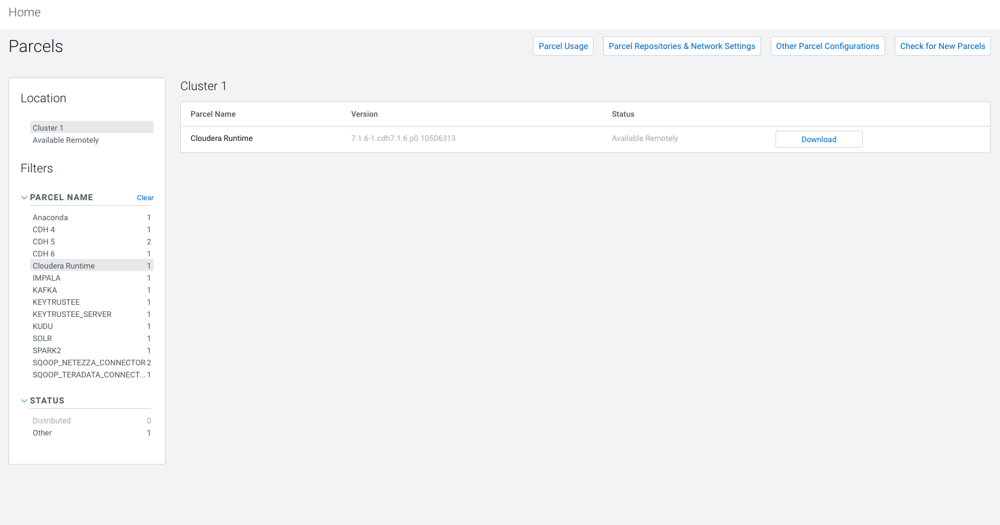


### Distribute


# Upgrade Wizard

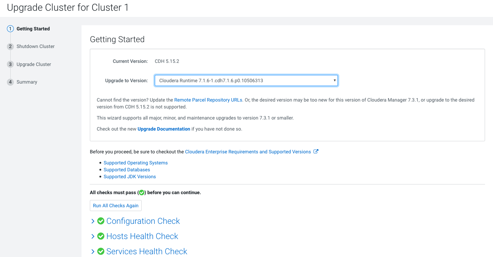

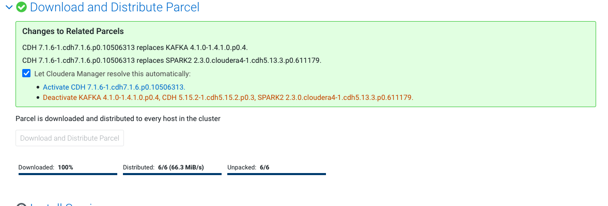

#### YARN Queue Manager has been added to the cluster. 	
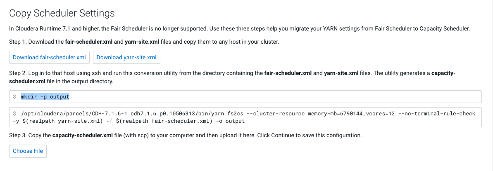

```
/opt/cloudera/parcels/CDH-7.1.6-1.cdh7.1.6.p0.10506313/bin/yarn fs2cs --cluster-resource memory-mb=6790144,vcores=12 --no-terminal-rule-check -y yarn-site.xml -f fair-scheduler.xml -o output/
WARNING: YARN_OPTS has been replaced by HADOOP_OPTS. Using value of YARN_OPTS.
21/06/22 08:14:31 INFO conf.Configuration: resource-types.xml not found
21/06/22 08:14:31 INFO resource.ResourceUtils: Unable to find 'resource-types.xml'.
21/06/22 08:14:31 INFO converter.FSConfigToCSConfigConverter: Output directory for yarn-site.xml and capacity-scheduler.xml is: output/
21/06/22 08:14:31 INFO converter.FSConfigToCSConfigConverter: Conversion rules file is not defined, using default conversion config!
21/06/22 08:14:31 INFO converter.FSConfigToCSConfigRuleHandler: No rule set for maxCapacityPercentage.action, defaulting to WARNING
21/06/22 08:14:31 INFO converter.FSConfigToCSConfigRuleHandler: No rule set for maxChildCapacity.action, defaulting to WARNING
21/06/22 08:14:31 INFO converter.FSConfigToCSConfigRuleHandler: No rule set for maxResources.action, defaulting to WARNING
21/06/22 08:14:31 INFO converter.FSConfigToCSConfigRuleHandler: No rule set for minResources.action, defaulting to WARNING
21/06/22 08:14:31 INFO converter.FSConfigToCSConfigRuleHandler: No rule set for dynamicMaxAssign.action, defaulting to WARNING
21/06/22 08:14:31 INFO converter.FSConfigToCSConfigRuleHandler: No rule set for reservationSystem.action, defaulting to WARNING
21/06/22 08:14:31 INFO converter.FSConfigToCSConfigRuleHandler: No rule set for queueAutoCreate.action, defaulting to WARNING
21/06/22 08:14:31 INFO converter.FSConfigToCSConfigRuleHandler: No rule set for fairAsDrf.action, defaulting to WARNING
21/06/22 08:14:31 INFO converter.FSConfigToCSConfigRuleHandler: No rule set for queueDynamicCreate.action, defaulting to WARNING
21/06/22 08:14:31 INFO converter.FSConfigToCSConfigRuleHandler: No rule set for parentDynamicCreate.action, defaulting to WARNING
21/06/22 08:14:31 INFO converter.FSConfigToCSConfigRuleHandler: No rule set for childStaticDynamicConflict.action, defaulting to WARNING
21/06/22 08:14:31 INFO converter.FSConfigToCSConfigRuleHandler: No rule set for parentChildCreateDiff.action, defaulting to WARNING
21/06/22 08:14:31 INFO converter.FSConfigToCSConfigConverter: Using explicitly defined fair-scheduler.xml
21/06/22 08:14:31 INFO security.YarnAuthorizationProvider: org.apache.hadoop.yarn.security.ConfiguredYarnAuthorizer is instantiated.
21/06/22 08:14:31 INFO scheduler.AbstractYarnScheduler: Minimum allocation = <memory:1024, vCores:1>
21/06/22 08:14:31 INFO scheduler.AbstractYarnScheduler: Maximum allocation = <memory:2543, vCores:4>
21/06/22 08:14:31 INFO placement.PlacementFactory: Creating PlacementRule implementation: class org.apache.hadoop.yarn.server.resourcemanager.placement.SpecifiedPlacementRule
21/06/22 08:14:31 INFO placement.PlacementFactory: Creating PlacementRule implementation: class org.apache.hadoop.yarn.server.resourcemanager.placement.UserPlacementRule
21/06/22 08:14:31 WARN fair.AllocationFileLoaderService: fair-scheduler.xml not found on the classpath.
21/06/22 08:14:31 INFO converter.FSConfigToCSConfigConverter: Converting placement rules
21/06/22 08:14:32 INFO scheduler.AbstractYarnScheduler: Minimum allocation = <memory:1024, vCores:1>
21/06/22 08:14:32 INFO scheduler.AbstractYarnScheduler: Maximum allocation = <memory:2543, vCores:4>
21/06/22 08:14:32 INFO capacity.ParentQueue: root, capacity=1.0, absoluteCapacity=1.0, maxCapacity=1.0, absoluteMaxCapacity=1.0, state=RUNNING, acls=ADMINISTER_QUEUE:*SUBMIT_APP:*, labels=*,
, reservationsContinueLooking=true, orderingPolicy=utilization, priority=0, allowZeroCapacitySum=false
21/06/22 08:14:32 INFO capacity.ParentQueue: Initialized parent-queue root name=root, fullname=root
21/06/22 08:14:32 INFO capacity.LeafQueue: Initializing root.default
capacity = 0.0 [= (float) configuredCapacity / 100 ]
absoluteCapacity = 0.0 [= parentAbsoluteCapacity * capacity ]
maxCapacity = 1.0 [= configuredMaxCapacity ]
absoluteMaxCapacity = 1.0 [= 1.0 maximumCapacity undefined, (parentAbsoluteMaxCapacity * maximumCapacity) / 100 otherwise ]
effectiveMinResource=<memory:0, vCores:0>
 , effectiveMaxResource=<memory:0, vCores:0>
userLimit = 100 [= configuredUserLimit ]
userLimitFactor = 1.0 [= configuredUserLimitFactor ]
maxApplications = -1 [= configuredMaximumSystemApplicationsPerQueue or (int)(configuredMaximumSystemApplications * absoluteCapacity)]
maxApplicationsPerUser = 0 [= (int)(maxApplications * (userLimit / 100.0f) * userLimitFactor) ]
maxParallelApps = 2147483647
usedCapacity = 0.0 [= usedResourcesMemory / (clusterResourceMemory * absoluteCapacity)]
absoluteUsedCapacity = 0.0 [= usedResourcesMemory / clusterResourceMemory]
maxAMResourcePerQueuePercent = 0.5 [= configuredMaximumAMResourcePercent ]
minimumAllocationFactor = 0.875 [= (float)(maximumAllocationMemory - minimumAllocationMemory) / maximumAllocationMemory ]
maximumAllocation = <memory:8192, vCores:4> [= configuredMaxAllocation ]
numContainers = 0 [= currentNumContainers ]
state = RUNNING [= configuredState ]
acls = ADMINISTER_QUEUE: SUBMIT_APP:  [= configuredAcls ]
nodeLocalityDelay = 40
rackLocalityAdditionalDelay = -1
labels=*,
reservationsContinueLooking = true
preemptionDisabled = true
defaultAppPriorityPerQueue = 0
priority = 0
maxLifetime = -1 seconds
defaultLifetime = -1 seconds
21/06/22 08:14:32 INFO capacity.CapacitySchedulerQueueManager: Initialized queue: root.default
21/06/22 08:14:32 INFO capacity.CapacitySchedulerQueueManager: Initialized queue: root
21/06/22 08:14:32 INFO capacity.CapacitySchedulerQueueManager: Initialized root queue root: numChildQueue= 1, capacity=1.0, absoluteCapacity=1.0, usedResources=<memory:0, vCores:0>usedCapacity=0.0, numApps=0, numContainers=0
21/06/22 08:14:32 INFO placement.CSMappingPlacementRule: Initializing CSMappingPlacementRule queue mapping manager.
21/06/22 08:14:32 INFO capacity.CapacitySchedulerConfiguration: Reading mapping rules from provided inline JSON '{
  "rules" : [ {
    "type" : "user",
    "matches" : "*",
    "policy" : "specified",
    "fallbackResult" : "skip",
    "create" : true
  }, {
    "type" : "user",
    "matches" : "*",
    "policy" : "user",
    "parentQueue" : "root",
    "fallbackResult" : "skip",
    "create" : true
  } ]
}'.
21/06/22 08:14:32 INFO placement.CSMappingPlacementRule: Initialized queue mappings, can override user specified queues: true  number of rules: 2 mapping rules: [MappingRule{matcher=MatchAllMatcher, action=PlaceToQueueAction{queueName='%specified'}}, MappingRule{matcher=MatchAllMatcher, action=PlaceToQueueAction{queueName='root.%user'}}]
21/06/22 08:14:32 INFO capacity.WorkflowPriorityMappingsManager: Initialized workflow priority mappings, override: false
21/06/22 08:14:32 INFO capacity.CapacityScheduler: Initialized CapacityScheduler with calculator=class org.apache.hadoop.yarn.util.resource.DefaultResourceCalculator, minimumAllocation=<<memory:1024, vCores:1>>, maximumAllocation=<<memory:2543, vCores:4>>, asynchronousScheduling=false, asyncScheduleInterval=5ms,multiNodePlacementEnabled=false
21/06/22 08:14:32 INFO converter.ConvertedConfigValidator: Capacity scheduler was successfully started
21/06/22 08:14:32 INFO activities.ActivitiesManager: org.apache.hadoop.yarn.server.resourcemanager.scheduler.activities.ActivitiesManager thread interrupted
```

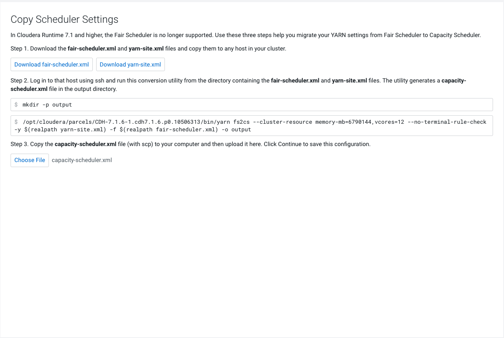


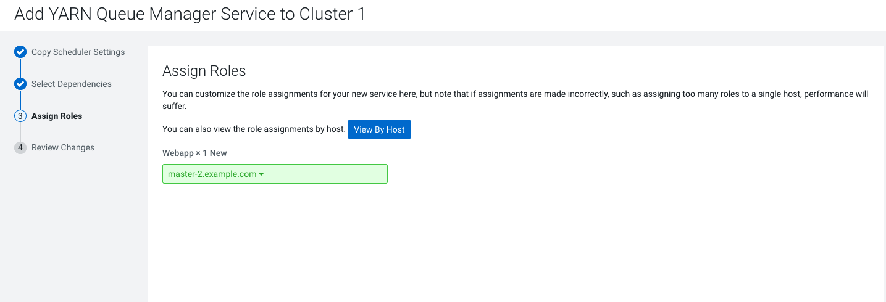

### Add Tez

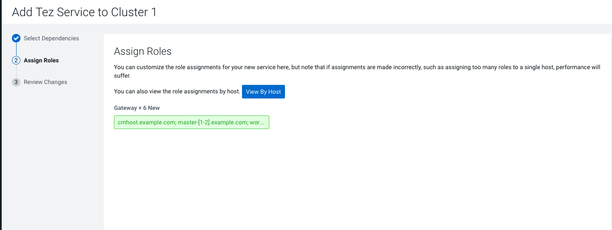

### Add Hive on Tez

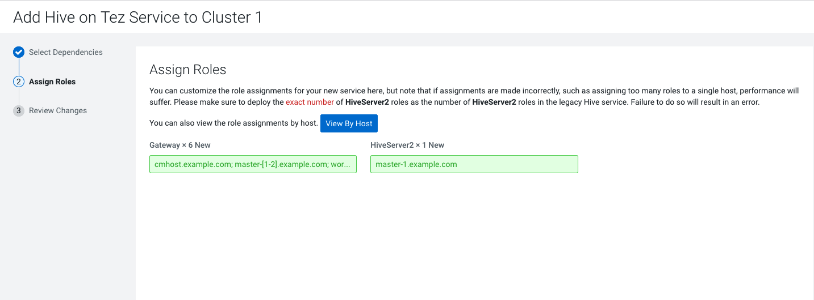

### Other Tasks
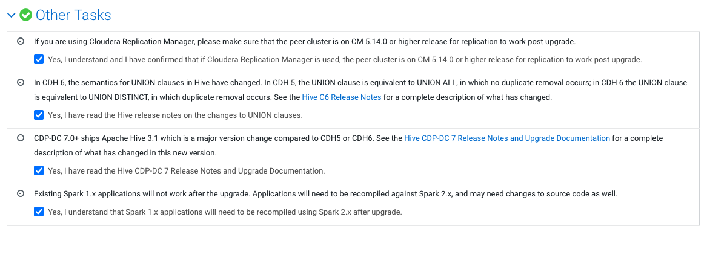

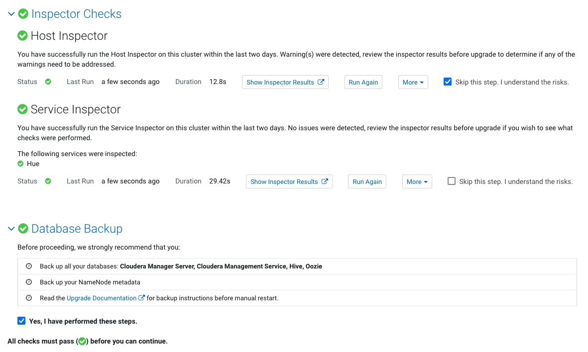


## Stop Cluster


## Upgrade Process

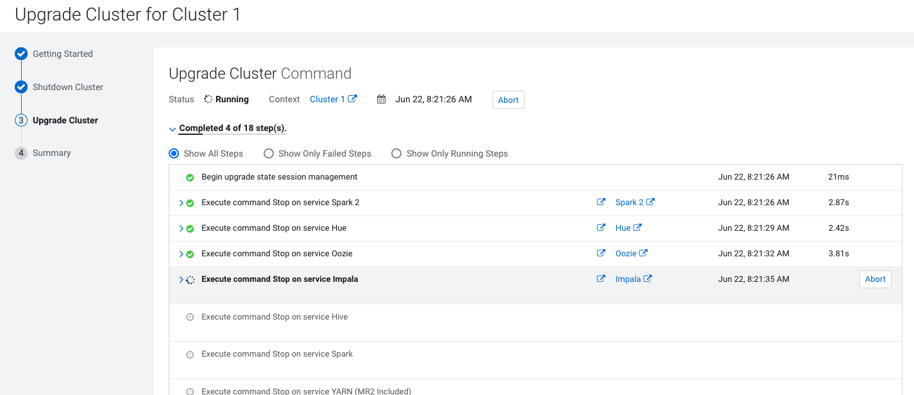

# Test the cluster


### Impala

```
[worker-1:21000] default> select count(*) from web_logs;
Query: select count(*) from web_logs
Query submitted at: 2021-06-22 23:31:37 (Coordinator: http://worker-1.example.com:25000)
Query progress can be monitored at: http://worker-1.example.com:25000/query_plan?query_id=574d0dc5cb170246:c7f233df00000000
+----------+
| count(*) |
+----------+
| 1000     |
+----------+
Fetched 1 row(s) in 1.60s
```

